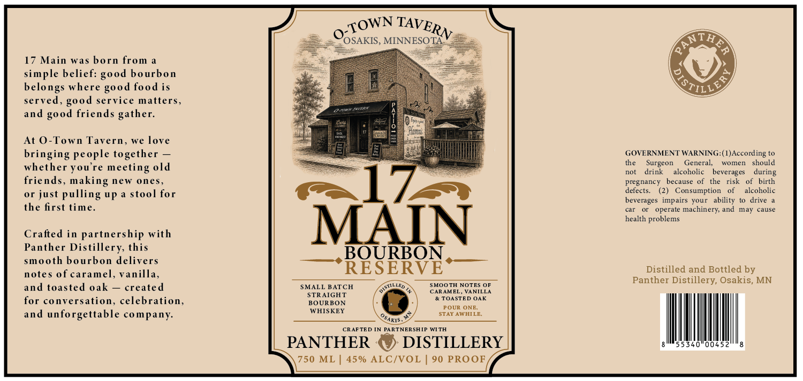

# TTB COLA Label Images - TTBID 26201001000419

**Brand Name:** PANTHER DISTILLERY

**Fanciful Name:** 17 MAIN BOURBON RESERVE

**Issue Date:** 07/23/2026

**Origin Code:** 27

**Product Class/Type:** 101

**Source:** [TTB Public COLA Registry](https://ttbonline.gov/colasonline/viewColaDetails.do?action=publicFormDisplay&ttbid=26201001000419)

## Label Images

### Label 1

## Extracted Label Text

*Text extracted via OCR - may contain errors*

**Detected Proof:** 90

### Label 1

'OSAKIS , MINNESOTA
17 Main was born from
simple belief:
bourbon
belongs where
food is
served,
service matters,
22ar
and
friends gather:
4
SQmug
At 0-Town Tavern, we love
bringing people together
GOVERNMENT WARNING:( )According
whether you re meeting old
the
Surgeon
General,
WOMEn
should
no
drink
alcoholic
beverages
friends,
neW
ones
17
pregnancy
because
the
risk
birth
or just
pulling up
stool for
defects
Consumption
alcoholic
beverages   impairs your   ability
drive
the first time_
car
operale
machinery; and
may
cause
health
problems
Crafted in partnership with
MAIN
Panther
Distillery this
BOURBON_
smooth bourbon delivers
notes of caramel, Vanilla,
RESERVE
Distilled and Bottled by
Panther
Distillery; Osakis, MN
and toasted oak
created
SMALL BATCH
~STHLLED
SMOOTH NOTES OF
CARAMEL , VANILLA
STRAIGHT
for
conversation, celebration,
& TOASTED OAK
BOURBON
POUR ONE:
and unforgettable company_
WHISKEY
STAY AWHILE
CRAFTED IN PARTNER SHIP
WITH
PANTHER
DISTILLERY
00
750 ML
45% ALC/VOL
90 PROOF
TOWN
TAVERN
ATHA
good
TILLE
good
good
good
during
making
OsAKIS
