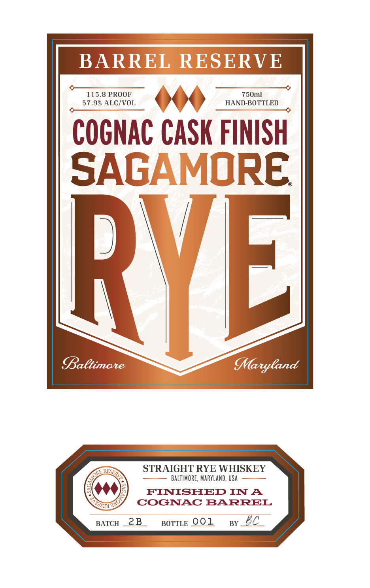
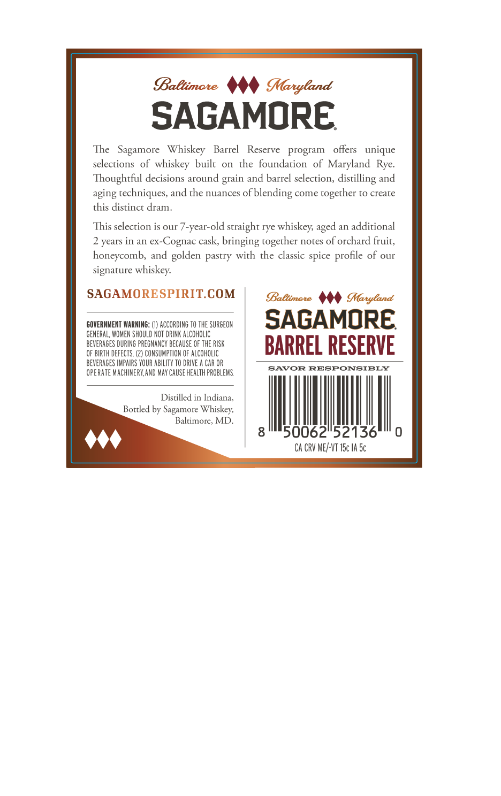

# TTB COLA Label Images - TTBID 26201001000431

**Brand Name:** SAGAMORE

**Fanciful Name:** BARREL RESERVE COGNAC CASK FINISH

**Issue Date:** 07/23/2026

**Origin Code:** 25

**Product Class/Type:** 102

**Source:** [TTB Public COLA Registry](https://ttbonline.gov/colasonline/viewColaDetails.do?action=publicFormDisplay&ttbid=26201001000431)

## Label Images

### Label 1

### Label 2

## Extracted Label Text

*Text extracted via OCR - may contain errors*

**Detected Proof:** 115.8
**Detected Age:** 2 Years

### Label 1

BARREL RESERVE
115.8 PROOF
750ml
57.9% ALC/VOL
HAND-BOTTLED
COGNAC CASK FINISH
SAGAMORE
RVEL
Baltimare
MMaryCand
STRAIGHT RYE WHISKEY
BALTIMORE, MARYLand, USA
FINISHED IN A
COGNAC BARREL
BATCH
2B
BOTTLE 001
BY
TUPSERV _
ORE ,
T4ol
S"

### Label 2

BaBtimate
MMaryland
SAGAMORE
The   Sagamore
Whiskey
Barrel
Reserve
program
offers
unique
selections of whiskey built
on   the foundation
of Maryland   Rye:
Thoughtful decisions around
and barrel selecrion, distilling and
aging rechniques, and the nuances ofblending come together ro create
this distinct dram.
This selection is our 7-year-old straight rye whiskey;
an
additional
2 years in an ex-=
Cognac cask, bringing togerher nores of orchard fruit,
honeycomb,
and
pastry with the classic spice
of our
signature whiskey:
SAGAMORESPIRITCOM
Baltimote
Maryland
COVERNMENT WARNING: (1) ACCORDING TO THE SURGEON
SAGAMORE
GENERAL, WOMEN ShOULD NOT DRINK ALCOHOLIC
BEVERAGES DURING PREGNANCY BECHUSE OF THE RISK
BARREL RESERVE
OF BIRTH dEfECTS
CONSUMPTION F AlcoholIC
BEVERAGES IMPAIRS YOUR ABILITY TO DRIVE
CAR OR
opeRATE MaChNERY,AND MaY CAUSE health probleMS
SAVOR
RESPONSIBLY
Distilled in Indiana;
Botrled by Sagamore Whiskey;
Baltimore, MD
50062"52136
Ca CRV ME/-VT ISc IA Sc
grain
aged
profile
golden
