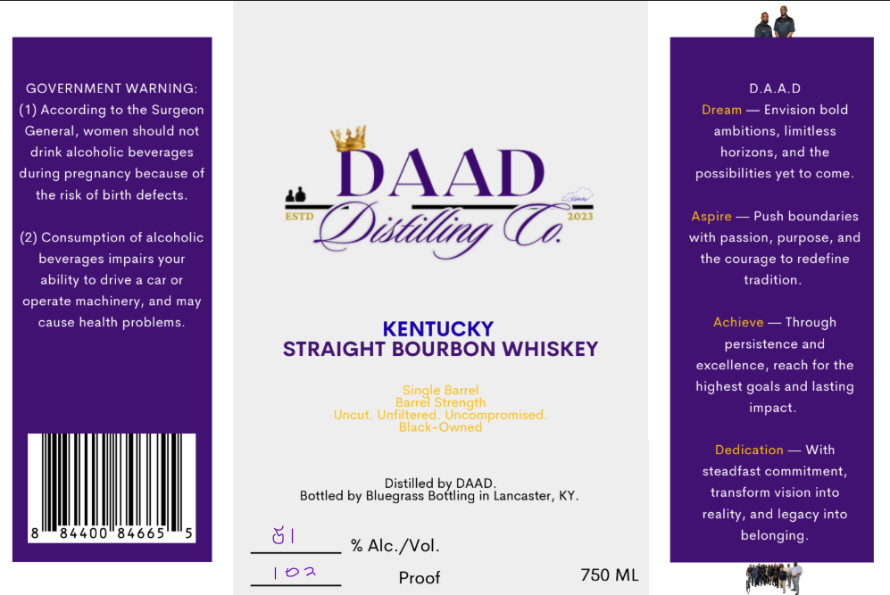

# TTB COLA Label Images - TTBID 26201001000443

**Brand Name:** DAAD

**Issue Date:** 08/06/2026

**Origin Code:** 22

**Product Class/Type:** 101

**Source:** [TTB Public COLA Registry](https://ttbonline.gov/colasonline/viewColaDetails.do?action=publicFormDisplay&ttbid=26201001000443)

## Label Images

### Label 1

## Extracted Label Text

*Text extracted via OCR - may contain errors*

**Detected Proof:** 102

### Label 1

GOVERNMENT WARNING:
DAAD
According to the Surgeon
Dream
Envision bold
General,
women should not
ambitions
limitless
drink alcoholic beverages
horizons, and the
during pregnancy because of
DAAD
possibilities yet to come_
the risk of birth defects
ESTD
2071
Aspire
Push boundaries
Consumption of alcoholic
Tistilling (
with passion, purpose, and
beverages impairs your
the courage to redefine
ability to drive
cai Or
tradition
operate machinery, and may
cause health problems
KENTUCKY
Achieve
Through
STRAIGHT BOURBON WHISKEY
persistence and
excellence_
reach for the
Singie Barrel
highest
and lasting
parre
Strength
impact.
Uncu  Unfiltered
Uncompromised
Black-Owned
Dedication
With
steadfast commitment,
Distilled by DAAD_
Bottled by Bluegrass Bottling in Lancaster, KY_
transform vision into
reality, and legacy into
4400
84665
belonging
% Alc-/Vol.
102
Proof
750 ML
goals
