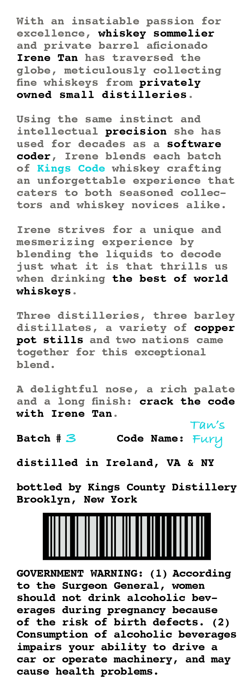
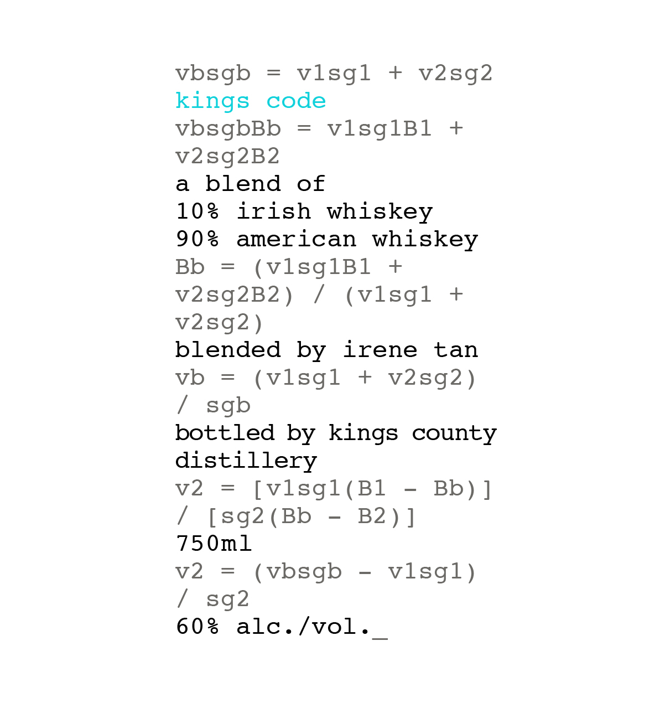

# TTB COLA Label Images - TTBID 26201001000452

**Brand Name:** KINGS CODE

**Issue Date:** 07/23/2026

**Origin Code:** 02

**Product Class/Type:** 140

**Source:** [TTB Public COLA Registry](https://ttbonline.gov/colasonline/viewColaDetails.do?action=publicFormDisplay&ttbid=26201001000452)

## Label Images

### Back Label

### Front Label

## Extracted Label Text

*Text extracted via OCR - may contain errors*

### Back Label

With
an
insatiable passion
for
excellence, whiskey
sommelier
and private
barrel
aficionado
Irene
Tan
has
traversed
the
globe_
meticulously
collecting
fine
whiskeys
from privately
owned
small
distilleries
Using
the
same
instinct
and
intellectual
precision
she
has
uSed
for
decades
as
Software
coder
Irene
blends
each
batch
of Kings
Code whiskey crafting
an
unforgettable
experience
that
caters
to
both
Seasoned
collec-
tors
and
whiskey
novices
alike
Irene
strives
for
unique
and
mesmerizing
experience
by
blending
the
liquids
to
decode
just
what
it
iS
that
thrills
uS
when
drinking
the
best
of
world
whiskeys
Three
distilleries
three
barley
distillates
variety
of
copper
pot
stills
and
two
nations
came
together
for
this
exceptional
blend _
A
delightful
nose ,
rich palate
and
long
finish:
crack
the
code
with
Irene
Tan
Tan's
Batch
#3
Code
Name :
Fury
distilled
in
Ireland ,
VA
NY
bottled by Kings
County Distillery
Brooklyn ,
New
York
GOVERNMENT
WARNING :
(1) According
to
the
Surgeon
General
women
should
drink
alcoholic
bev -
erages
during
pregnancy
because
of
the
risk
of
birth
defects .
(2)
Consumption
of
alcoholic beverages
impairs
your ability
to
drive
car
or
operate machinery,
and
may
cause
health problems
not

### Front Label

vbsgb
vlsgl
+
v2sg2
kings
code
vbsgbBb
vlsglBl
+
v2sg2B2
a
blend
of
10s
irish whiskey
908
american whiskey
Bb
(vlsglBl
v2sg2B2 )
(vlsgl
+
v2sg2 )
blended
by
irene
tan
vb
(vlsgl
+
v2sg2 )
bottled
kings county
distillery
v2
[vlsgl (Bl
1
[sg2 ( Bb
B2 ) ]
75 0m1
v2
(vbsgb
vlsgl )
sg2
609
alc./vol
sgb
by
Bb )
