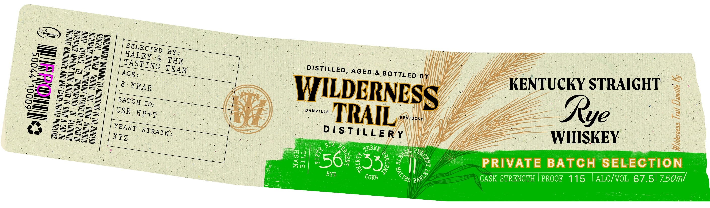
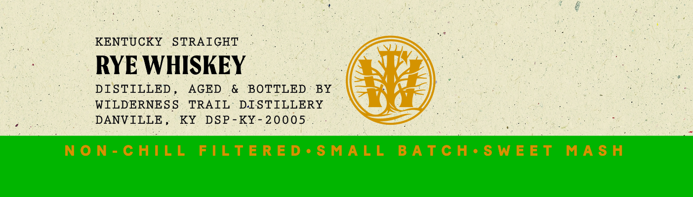

# TTB COLA Label Images - TTBID 26201001000475

**Brand Name:** WILDERNESS TRAIL

**Issue Date:** 07/23/2026

**Origin Code:** 22

**Product Class/Type:** 102

**Source:** [TTB Public COLA Registry](https://ttbonline.gov/colasonline/viewColaDetails.do?action=publicFormDisplay&ttbid=26201001000475)

## Label Images

### Label 1

### Label 2

### Label 3

## Extracted Label Text

*Text extracted via OCR - may contain errors*

*2 image(s) excluded: text did not meet readability threshold*

### Label 2

KENTUCKY STRAIGHT

RYE WHISKEY

DISTILLED,

AGED & BOTTLED: BY

WILDERNESS TRAIL DISTILLERY

pene KY DSP-K¥-20005

NON-CHILL FILTERED*-SMALL BATCH*SWEET MASH
