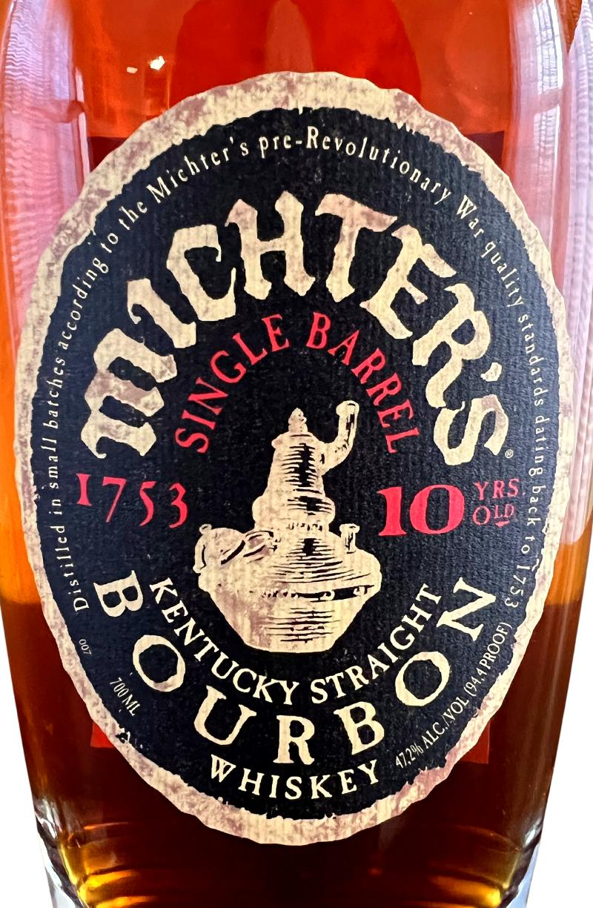
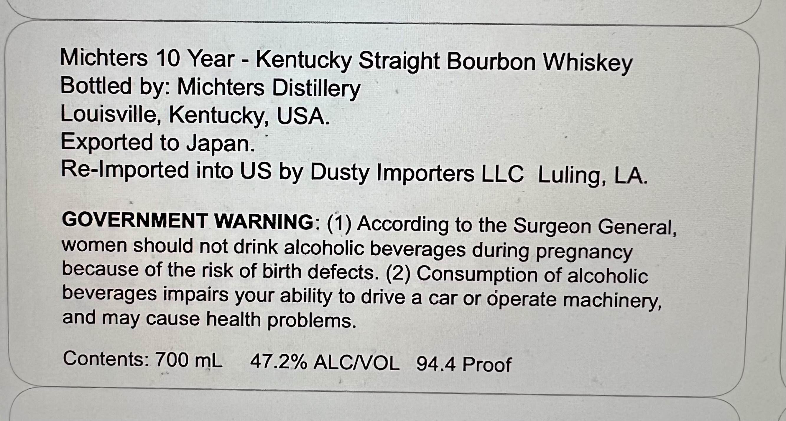

# TTB COLA Label Images - TTBID 26202001000051

**Brand Name:** MICHTER'S

**Issue Date:** 07/23/2026

**Origin Code:** 00

**Product Class/Type:** 101

**Source:** [TTB Public COLA Registry](https://ttbonline.gov/colasonline/viewColaDetails.do?action=publicFormDisplay&ttbid=26202001000051)

## Label Images

### Label 1

### Label 2

## Extracted Label Text

*Text extracted via OCR - may contain errors*

*1 image(s) excluded: text did not meet readability threshold*

**Detected Proof:** 94.4
**Detected Age:** 10 Years

### Label 2

Michters 10 Year
Kentucky Straight Bourbon Whiskey
Bottled
Michters Distillery
Louisville, Kentucky, USA
Exported to Japan.
Re-Imported into US by Dusty Importers LLC Luling, LA
GOVERNMENT WARNING: (1) According to the Surgeon General,
women should not drink alcoholic beverages during pregnancy
because of the risk Of birth defects. (2) Consumption of alcoholic
beverages impairs your ability to drive a car or operate machinery,
and may cause health problems.
Contents: 700 mL
47.2% ALCNOL
94.4 Proof
by:
