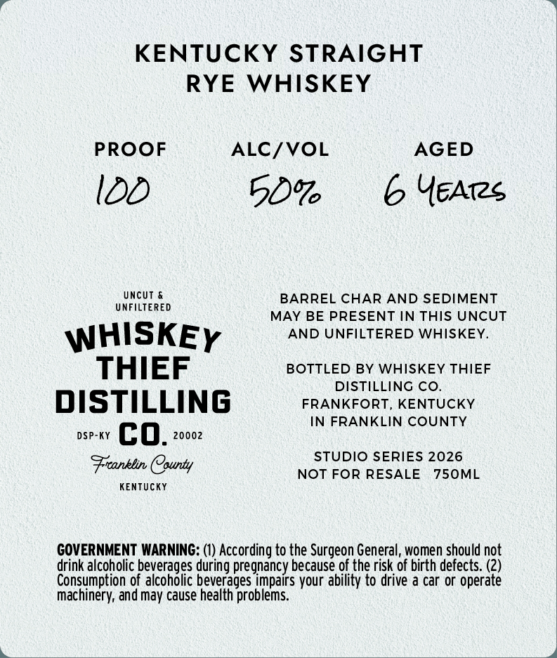
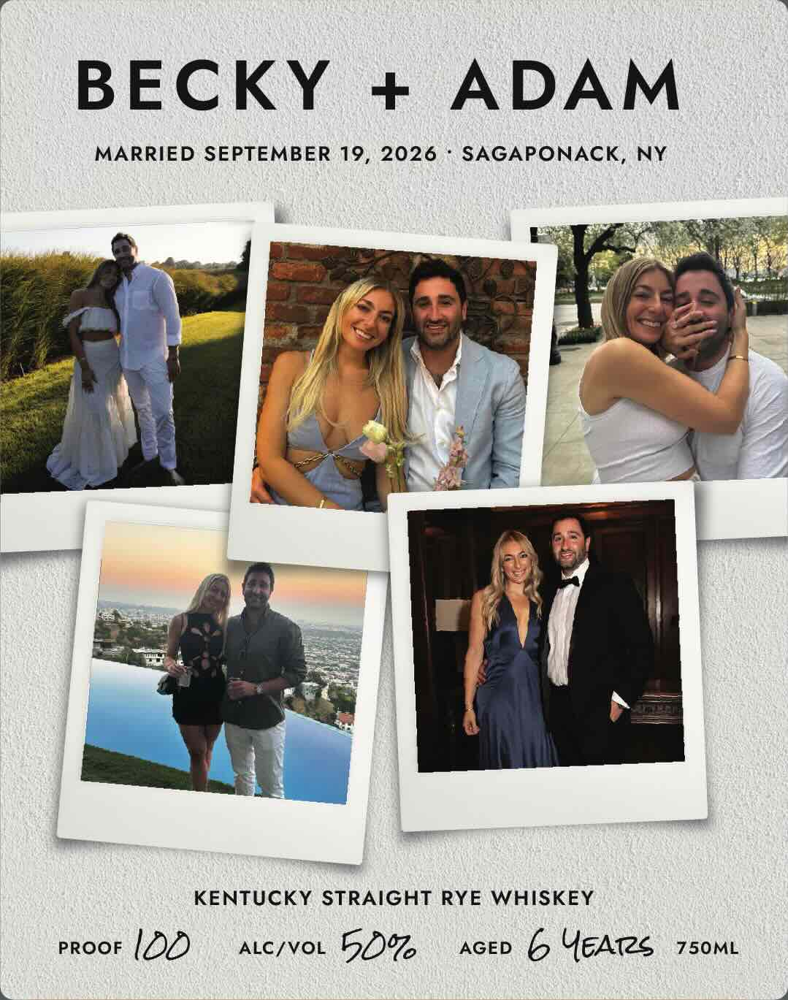

# TTB COLA Label Images - TTBID 26202001000055

**Brand Name:** WHISKEY THIEF DISTILLING CO.

**Fanciful Name:** BECKY + ADAM

**Issue Date:** 07/23/2026

**Origin Code:** 22

**Product Class/Type:** 102

**Source:** [TTB Public COLA Registry](https://ttbonline.gov/colasonline/viewColaDetails.do?action=publicFormDisplay&ttbid=26202001000055)

## Label Images

### Back Label

### Front Label

## Extracted Label Text

*Text extracted via OCR - may contain errors*

**Detected Proof:** 100

### Back Label

KENTUCKY STRAIGHT
RYE
WHISKEY
PROOF
ALC/VOL
AGED
IDD
5096
YEAis
UNFcWERED
UncUT
BARREL CHAR AND SEDIMENT
MAY BE PRESENT IN THIS UNCUT
WHISKEY
AND UNFILTERED WHISKEY
THIEF
BOTTLED BY WHISKEY THIEF
DISTILLING CO
DISTILLING
FRANKFORT
KENTUCKY
FRANKLIN COUNTY
DSP
co_
20002
STUDIO SERIES 2026
Frronblin County
NOT FOR RESALE
750ML
KEnTUcKY
GOVERNMENT WARNING:
According to the Surgeon General, women should not
drink alcoholic beverages during pregnancy because of the risk of birth defects: (2)
Consumption of alcoholic beverages impairs your ability to drive a car or operate
machinery; and may cause health problems.

### Front Label

BECKY
ADAM
MARRIED SEPTEMBER 19,
2026
SAGAPONACK, NY
KENTUCKY STRAIGHT RYE WHISKEY
PROOF
IDD
ALC/VOL
50%
AGED
6 YEATs
750ML
