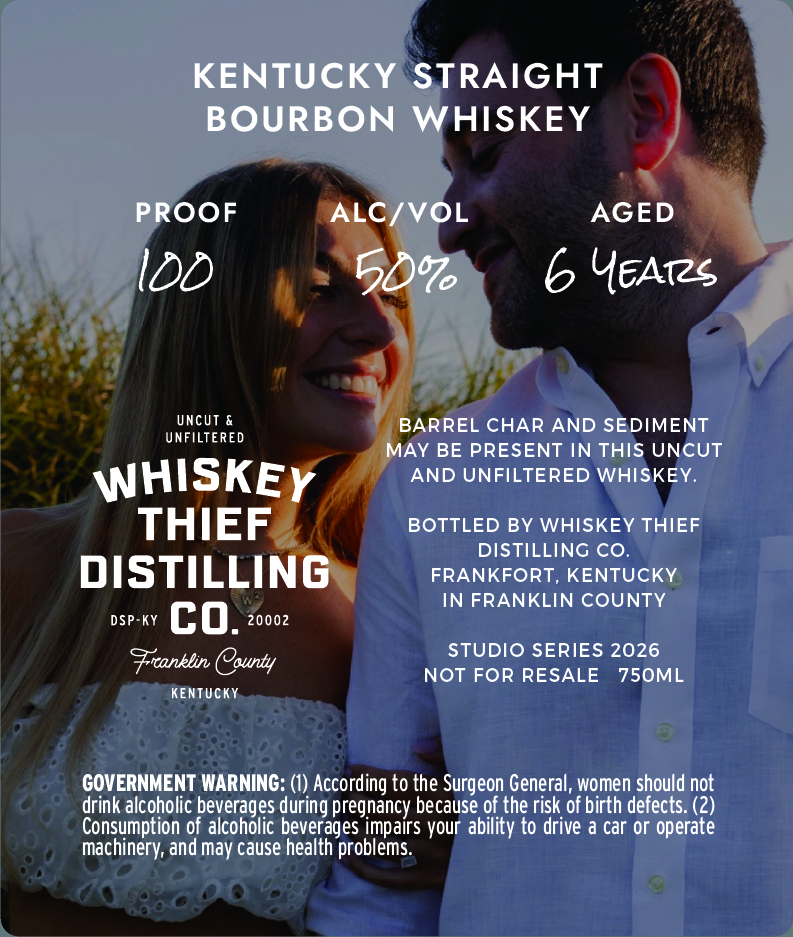
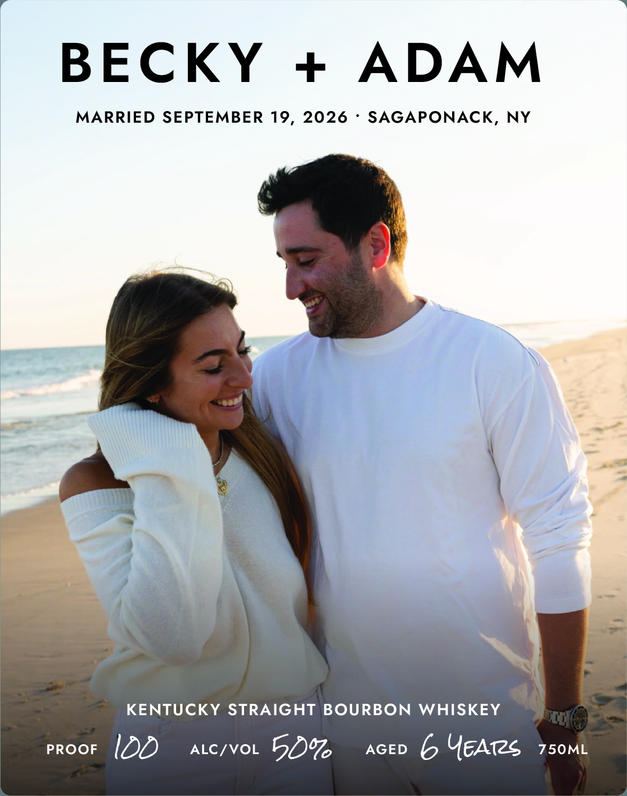

# TTB COLA Label Images - TTBID 26202001000056

**Brand Name:** WHISKEY THIEF DISTILLING CO.

**Fanciful Name:** BECKY + ADAM

**Issue Date:** 07/23/2026

**Origin Code:** 22

**Product Class/Type:** 101

**Source:** [TTB Public COLA Registry](https://ttbonline.gov/colasonline/viewColaDetails.do?action=publicFormDisplay&ttbid=26202001000056)

## Label Images

### Back Label

### Front Label

## Extracted Label Text

*Text extracted via OCR - may contain errors*

### Back Label

KENTUCKY
STRAIGHT
BOURBON
WHISKEY
PROOF
ALC/VOL
AGED
LDD
67
6 YEATzs
UncUt &
BARREL CHAR AND SEDIMENT
UNFILTERED
MAY BE PRESENT IN THIS UNCUT
WHISKEY
AND UNFILTERED WHISKEY.
THIEF
BOTTLED BY WHISKEY THIEF
DISTILLING CO.
DISTILLING
FRANKFORT
KENTUCKY
IN FRANKLIN COUNTY
DSP-KY
co.
20002
STUDIO SERIES 2026
Frranklin Oaunty
NOT FOR RESALE
750ML
KENTUCKY
GOVERNMENT WARNING: (1) According to the Surgeon General, women should not
drink alcoholic beverages during pregnancy because of the risk of birth defects: (2)
Consumption of alcoholic beverages impairs your ability to drive & car or operate
machinery; and may cause health problems.

### Front Label

BECKY
ADAM
MARRIED SEPTEMBER 19_
2026
SAGAPONACK,
NY
KENTUCKY STRAIGHT BOURBON
WHISKEY
PROOF
IDD
ALC/VOL
5007
AGED
6 UEATZS
750ML
