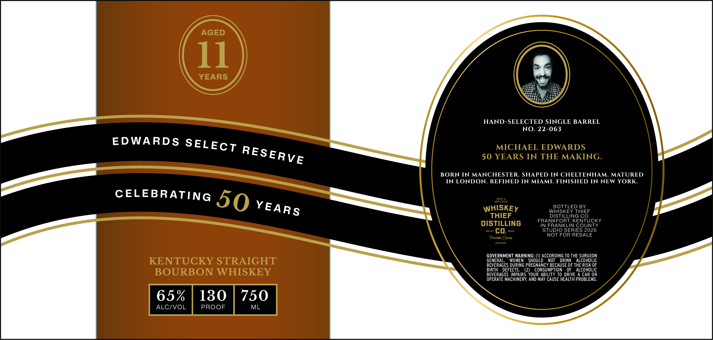

# TTB COLA Label Images - TTBID 26202001000057

**Brand Name:** EDWARDS SELECT RESERVE

**Issue Date:** 07/27/2026

**Origin Code:** 22

**Product Class/Type:** 101

**Source:** [TTB Public COLA Registry](https://ttbonline.gov/colasonline/viewColaDetails.do?action=publicFormDisplay&ttbid=26202001000057)

## Label Images

### Label 1

## Extracted Label Text

*Text extracted via OCR - may contain errors*

**Detected Proof:** 130
**Detected Age:** 11 Years

### Label 1

AGED
11
YEARS
HAND-SELECTED SINGLE BARREL
NO. 22-063
MICHAEL EDWARDS
50 YEARS IN THE MAKING.
BORN IN MANCHESTER. SHAPED IN CHELTENHAM. MATURED
IN LONDON. REFINED IN MIAMI
FINISHED IN NEW YORK.
nc
UNFILTERED
WHISKEY
BOTTLED BY
WHISKEY THIEF
THIEF
DISTILLING CO_
FRANKFORT, KENTUCKY
DISTILLING
IN FRANKLIN COUNTY
DSP-KY
co.
Zoooz
STUDIO SERIES 2026
NOT FOR RESALE
Frantlin (Oaunty
Kentucky
GOVERNMENT WARNING: (1) AccoRding TO THE SURGEON
KENTUCKY STRAIGHT
GENERAL
WOMEN
SHOULD
NOT
DRINK
ALCOHOLIC
BEVERAGES DURING PREGNANCY BECAUSE OF THE RISK OF
BOURBON WHISKEY
BIRTH
DEFECTS
(2)
CONSUMPTION
OF
ALCOHOLIC
BEVERAGES IMPAIRS YOUR ABILITY TO DRIVE A CAR OR
OPERATE MACHINERY, AND MAY CAUSE HEALTH PROBLEMS_
65%
130
750
ALCIVOL
PROOF
ML
50
