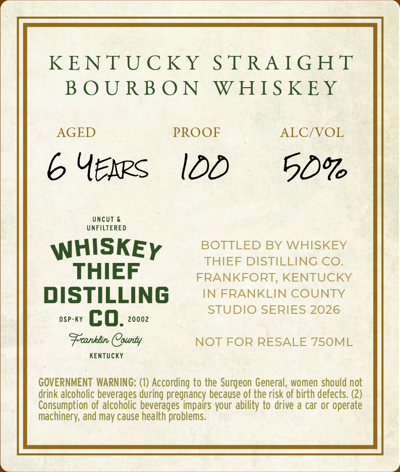
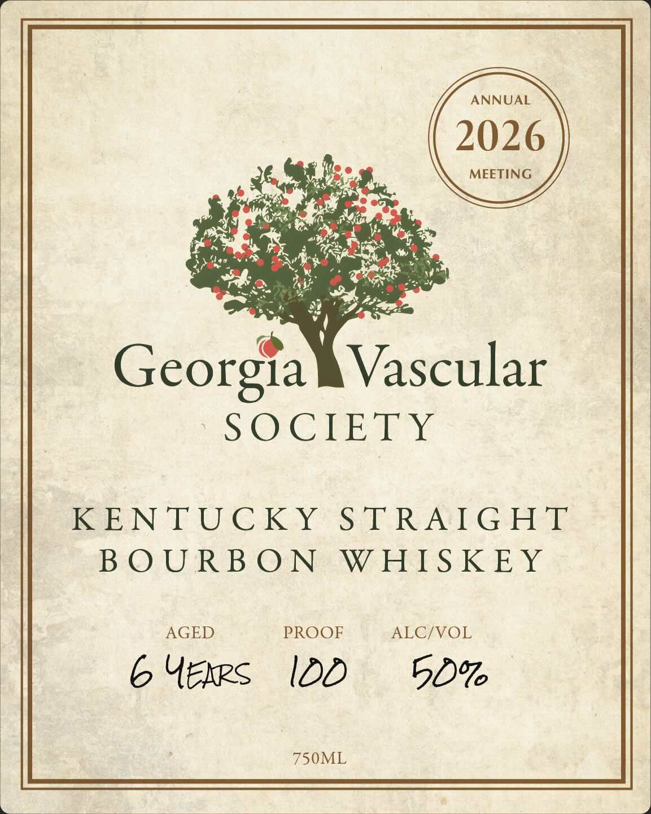

# TTB COLA Label Images - TTBID 26202001000060

**Brand Name:** WHISKEY THIEF DISTILLING CO.

**Fanciful Name:** GEORGIA VASCULAR SOCIETY

**Issue Date:** 07/24/2026

**Origin Code:** 22

**Product Class/Type:** 101

**Source:** [TTB Public COLA Registry](https://ttbonline.gov/colasonline/viewColaDetails.do?action=publicFormDisplay&ttbid=26202001000060)

## Label Images

### Back Label

### Front Label

## Extracted Label Text

*Text extracted via OCR - may contain errors*

**Detected Proof:** 100

### Back Label

KENTUC KY
S TRAIGHT
B 0 U RB O0 N
WHIS KEY
AGED
PROOF
ALC/VOL
6 Ueks
IDD
50'
Uncut
UNFILTERED
WHISKEY
BOTTLED BY WHISKEY
THIEF DISTILLING CO
THIEF
FRANKFORT
KENTUCKY
DISTILLING
IN FRANKLIN COUNTY
STUDIO SERIES 2026
DSP-KY
co.
20002
Frranklin COounty
NOT FOR RESALE 750ML
KEnTUcKY
GOVERNMENT  WARNING: (1) According to the Surgeon General, women should not
drink alcoholic beverages during pregnancy because of the risk of birth defects: (2)
Consumption of alcoholic beverages impairs your ability to drive a car or operate
machinery; and may cause health problems:

### Front Label

ANNUAL
2026
MEETING
Georgia
Vascular
SOCIETY
KENTUC KY
S TRAIGHT
B 0 U R B 0 N
WHIS KEY
AGED
PROOF
ALC/VOL
6 UekRs
IDD
50%
750ML
