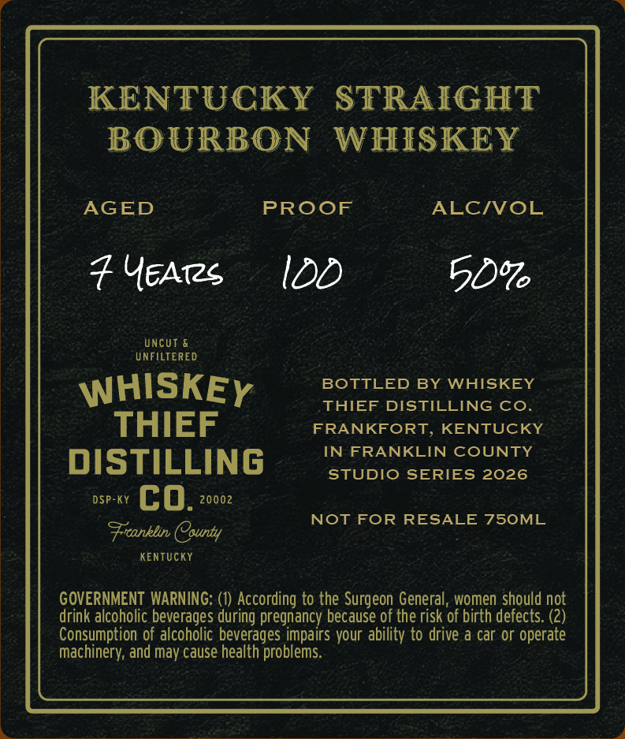
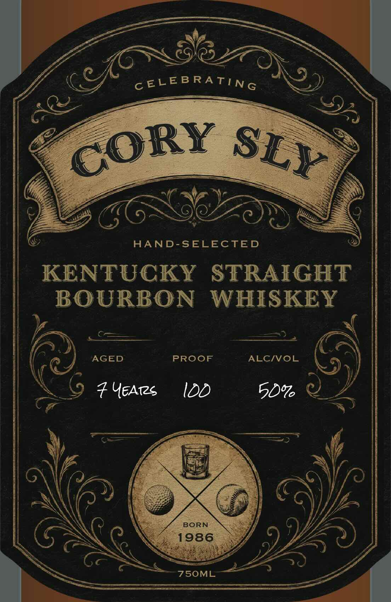

# TTB COLA Label Images - TTBID 26202001000061

**Brand Name:** WHISKEY THIEF DISTILLING CO.

**Fanciful Name:** CORY SLY

**Issue Date:** 07/23/2026

**Origin Code:** 22

**Product Class/Type:** 101

**Source:** [TTB Public COLA Registry](https://ttbonline.gov/colasonline/viewColaDetails.do?action=publicFormDisplay&ttbid=26202001000061)

## Label Images

### Back Label

### Front Label

## Extracted Label Text

*Text extracted via OCR - may contain errors*

**Detected Proof:** 100

### Back Label

KENTUCKY
STRAIGHT
BOURBON
WHISKEY
AGED
PROOF
ALCIVOL
7 UEATzS
IDD
5066
UncUT
UNFILTERED
WHISKEY
BOTTLED BY WHISKEY
THIEF DISTILLING CO
THIEF
FRANKFORT, KENTUCKY
IN FRANKLIN COUNTY
DISTILLING
STUDIO
SERIES 2026
DSP-KY
cO.
20002
NOT FOR
RESALE 750ML
Frconklin County
KEnTUCKY
GOVERNMENT WARNING: (0) According to the Surgeon General, women should not
drink alcoholic beverages during pregnancy because of the risk of birth defects: (2)
Consumption of alcoholic beverages impairs your ability to drive a car or operate
machinery; and may cause health problems.

### Front Label

c ELEB RATING
AAND-SELECTED
KENTUCKY
STRAIGHT
BOURBON
WHISKEY
AGED
PROOF
ALCIVOL
7 YEATzS
IDD
50%
BORN
1986
75OML
(c/6
CORY
SEY
