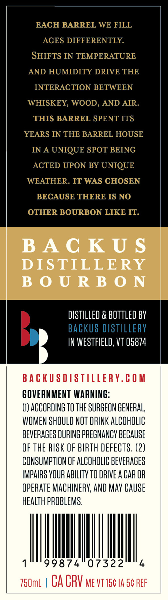
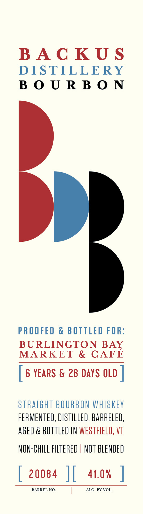

# TTB COLA Label Images - TTBID 26202001000083

**Brand Name:** BACKUS DISTILLERY, LLC

**Issue Date:** 07/23/2026

**Origin Code:** 46

**Product Class/Type:** 101

**Source:** [TTB Public COLA Registry](https://ttbonline.gov/colasonline/viewColaDetails.do?action=publicFormDisplay&ttbid=26202001000083)

## Label Images

### Back Label

### Front Label

## Extracted Label Text

*Text extracted via OCR - may contain errors*

**Detected Age:** 6 Years

### Back Label

EACH BARREL WE FILL
AGES DIFFERENTLY
SHIFTS IN TEMPERATURE
AND HUMIDITY DRIVE THE
INTERACTION BETWEEN
WHISKEY, WOOD, AND AIR
THIS BARREL SPENT ITS
YEARS IN THE BARREL HOUSE
IN A UNIQUE SPOT BEING
ACTED UPON BY UNIQUE
WEATHER IT WAS CHOSEN
BECAUSE THERE IS NO
OTHER BOURBON LIKE IT
BA C K U $
DISTILLERY
B 0 U R B 0 N
dISTILLED & BOTTLED BY
Backus DISTILLERY
IN WESTFIELD, VT 05874
BaCkUSDISTILLERY.COM
GOVERNMENT WARNING:
(1) ACCORDING TO THE SURGEON GENERAL,
WOMEN SHOULD NOT DRINK ALCOhOLIc
BEVERAGES DURING PREGNANCV BECAUSE
QF THE RISK OF BIRTH DEFECTS. (2)
CONSUMPTHON OF ALCOHOLIC BEVERAGES
IMPAIRS VOUR AbiLITy TO DRIVE A CAR OR
OpERATE MAChINERV; AND May CAUSE
heALTh PROBLEMS,
99874
07322
750mL
CA CRV Me VT 15c IA 5c REF

### Front Label

BACKUS
DISTILLERY
BOURBON
PROOFED & BOTTLED FOR:
BURLINGTON BAY
MARKET & CAFE
[ 6 YEARS & 28 DAYS OLD |
STRAIGHT BOURBON WHISKEY
FERMENTED, DISTILLED, BARRELED,
AGED & BOTTLED IN WESTFIELD, VT
NON-CHILL FLTERED | NOT BLENDED
[ 20084 |{ 41.0% |
