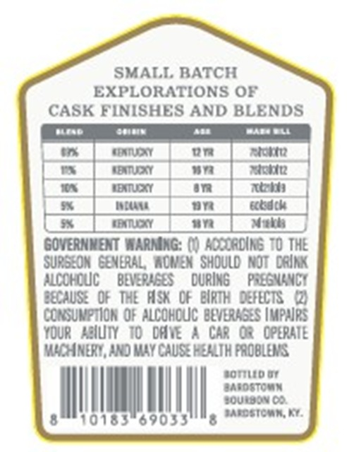
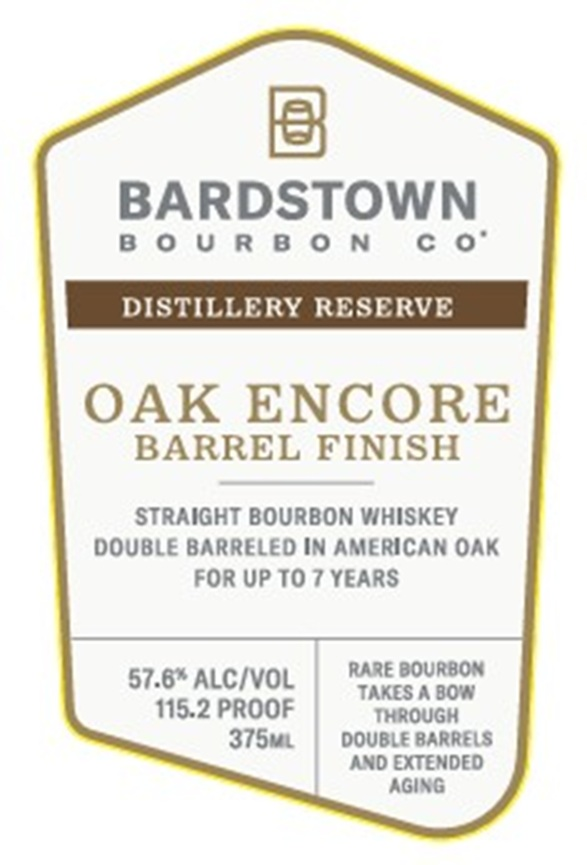
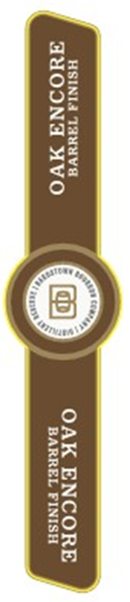

# TTB COLA Label Images - TTBID 26202001000087

**Brand Name:** BARDSTOWN BOURBON CO.

**Issue Date:** 07/23/2026

**Origin Code:** 22

**Product Class/Type:** 101

**Source:** [TTB Public COLA Registry](https://ttbonline.gov/colasonline/viewColaDetails.do?action=publicFormDisplay&ttbid=26202001000087)

## Label Images

### Back Label

### Label 1

### Label 3

## Extracted Label Text

*Text extracted via OCR - may contain errors*

**Detected Proof:** 115.2
**Detected Age:** 7 Years

### Back Label

SMALL BATCH

EXPLORATIONS OF

CASK FINISHES AND BLENDS

nme

cece

=

wane LL

=

on

“A

—

—|

aA.

Woe

on

etd

ae a

GOVERNMENT WARNING: (I) ACCORDING TO THE

SURGEON GENERAL WOMEN SHOULD NOT DRINK

ALCOHDUC BEVERAGES DURING PREGNANCY

BECAUSE OF THE ASK OF BIRTH DEFECTS (

CONSUMPTION OF ALCOHOUC BEVERAGES IMPAIRS

YOUR ABILITY TO DAVE A CAR OR OPERATE

MACHINERY, AND MAY CAUSE HEALTH PROBLEMS.

sorrito oF

BASOSTOMN

00

POUEBON OD

I

10183°69033

g *atostomn, Kr.

### Label 1

5

BARDSTOWN

BOURBON

DISTILLERY

RESERVE

OAK ENCORE

BARREL FINISH

STRAIGHT BOURBON WHISKEY

DOUBLE BARRELED IN AMERICAN OAK

FOR UP TO 7 YEARS

57.6" ALC/VOL

RARE BOURBON

TAKES A BOW

115.2 PROOF

375ui | DOUBLE BARRELS

AND EXTENDED

AGING

### Label 3

HSINIA THNUNVE ‘ OAK ENCORE

AUOONA AVO BARREL FINISH
