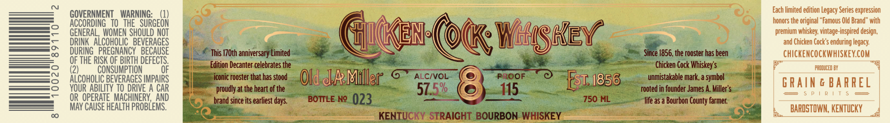

# TTB COLA Label Images - TTBID 26202001000088

**Brand Name:** CHICKEN COCK

**Issue Date:** 07/23/2026

**Origin Code:** 22

**Product Class/Type:** 101

**Source:** [TTB Public COLA Registry](https://ttbonline.gov/colasonline/viewColaDetails.do?action=publicFormDisplay&ttbid=26202001000088)

## Label Images

### Label 1

## Extracted Label Text

*Text extracted via OCR - may contain errors*

**Detected Proof:** 115

### Label 1

GOVERNMENT
WARNING:
Each limited edition Legacy Series expression
ACCORDING   TO   THE  SURGEON
honors the original
Famous Old Brand" with
BeheRAAEcondERc SBeVERaGeS^
GuEn (okk; Wosaey
~premium whiskey; vintage-inspired design;
DRINK   Al
BEVERAGES
and Chicken Cock' $ enduring legacy
DURING   PREGNANCY   BECAUSE
This I7Oth anniversary Limited
1856, the rooster has been
chickencockwhiskeyCOM
QF THE RISK OF BIRTH DeFECTS
Edition Decanter celebrates the
Chicken Cock Whiskey'$
(2)
CONSUMPTION
OF
PACDUCED BX
ALCoHOLIC BEVERAGES IMPAIRS
iconic rooster that has stood
Old &a Miller
6
ALCIVOL
PRoof
Est: /856
unmistakable mark; a symbol
GRaIn & BARREl
YOUR ABILITY TO DRIVE A CAR
proudly at the heart of the
57.5%
115
rooted in founder James A. Miller'
OR   OPERATE  MACHINERY,  AND
brand since its earliest days.
BOTTLE No
023
750 ML
life a5 a Bourbon County farmer
MAY CAUSE HEALTH PROBLEMS .
BARDSTOWN, KENTUCKY
KENTUCKY STRAIGHT BOURBON WHISKEY
Since "
