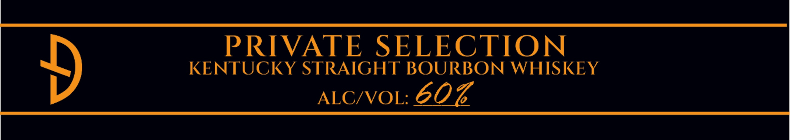
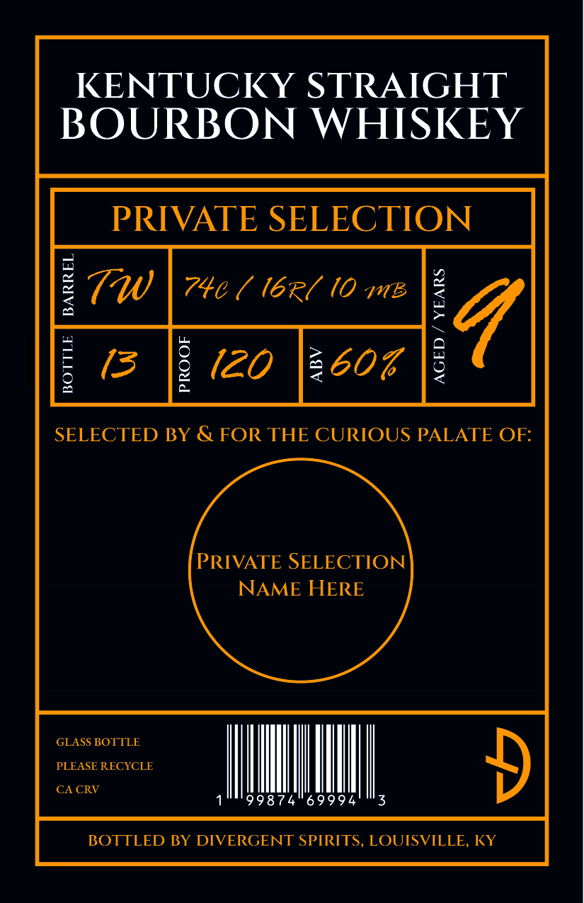
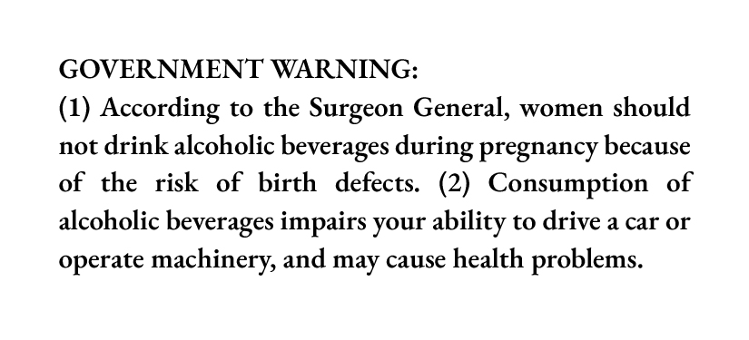

# TTB COLA Label Images - TTBID 26202001000104

**Brand Name:** DIVERGENT SPIRITS

**Issue Date:** 07/24/2026

**Origin Code:** 22

**Product Class/Type:** 101

**Source:** [TTB Public COLA Registry](https://ttbonline.gov/colasonline/viewColaDetails.do?action=publicFormDisplay&ttbid=26202001000104)

## Label Images

### Back Label

### Label 1

### Label 4

## Extracted Label Text

*Text extracted via OCR - may contain errors*

### Back Label

PRIVATE
SELECTION
KENTUCKY STRAIGHT BOURBON WHISKEY
ALCIVOL:
602

### Label 1

KENTUCKY STRAIGHT
BOURBON WHISKEY

RIVATE SELECTION

SELECTED BY & FOR THE CURIOUS PALATE OF:

DEF Fy

PROOF

AGED / YEARS

PRIVATE SELECTION
NAME HERE

GLASS BOTTLE
PLEASE RECYCLE
CACRV
1°" 99874569994 03

BOTTLED BY DIVERGENT SPIRITS, LOUISVILLE, KY

### Label 4

GOVERNMENT WARNING:

(1) According to the Surgeon General, women should

not drink alcoholic beverages during pregnancy because

of the risk of birth defects. (2) Consumption of

alcoholic beverages impairs your ability to drive a car or

operate machinery, and may cause health problems.
