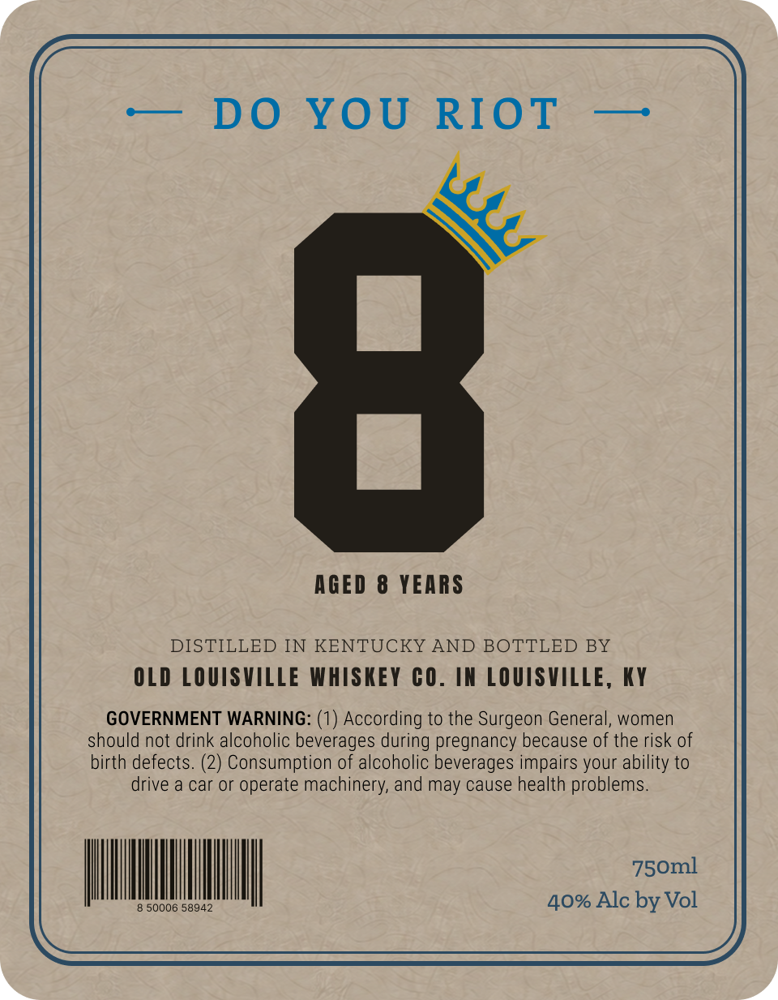
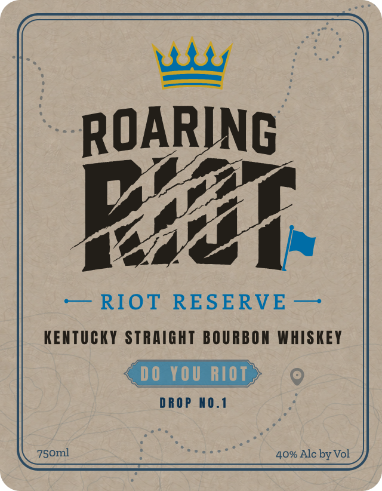

# TTB COLA Label Images - TTBID 26202001000140

**Brand Name:** ROARING RIOT

**Issue Date:** 07/28/2026

**Origin Code:** 22

**Product Class/Type:** 101

**Source:** [TTB Public COLA Registry](https://ttbonline.gov/colasonline/viewColaDetails.do?action=publicFormDisplay&ttbid=26202001000140)

## Label Images

### Back Label

### Front Label

## Extracted Label Text

*Text extracted via OCR - may contain errors*

**Detected Proof:** 80
**Detected Age:** 8 Years

### Back Label

—— DO YOU RIOT —

AGED 8 YEARS

DISTILLED IN KENTUCKY AND BOTTLED BY

OLD LOUISVILLE WHISKEY CO. IN LOUISVILLE, KY
GOVERNMENT WARNING: (1) According to the Surgeon General, women
should not drink alcoholic beverages during pregnancy because of the risk of

birth defects. (2) Consumption of alcoholic beverages impairs your ability to
drive a car or operate machinery, and may cause health problems.

NNN iat
40% Alc by Vol

8 50006 58942

### Front Label

ROARING
PX
RIOT
RESERVE
KENTUCKY STRAIGHT BOURBOK WHISKEY
00 YOU RIOT
D ROP
n0.1
750ml
40% Alc by Vol
