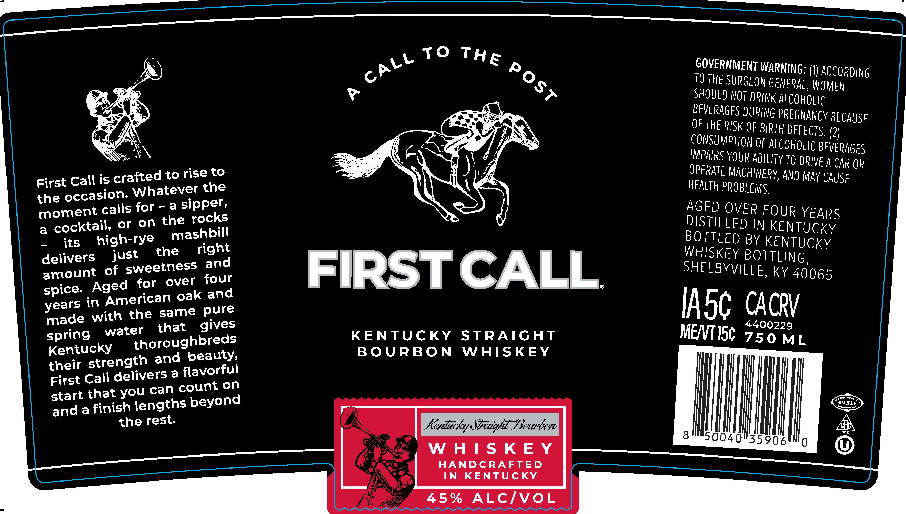

# TTB COLA Label Images - TTBID 26202001000197

**Brand Name:** FIRST CALL

**Issue Date:** 07/23/2026

**Origin Code:** 22

**Product Class/Type:** 101

**Source:** [TTB Public COLA Registry](https://ttbonline.gov/colasonline/viewColaDetails.do?action=publicFormDisplay&ttbid=26202001000197)

## Label Images

### Label 1

## Extracted Label Text

*Text extracted via OCR - may contain errors*

**Detected Proof:** 90

### Label 1

To
GOVERNMENT WARNING:
ACCORDING
TO THE SURGEON GENERAL, WOMEN
SHOULd NOT DRINK Alcoholic
BEVERages DURING PREGMANCY BECAUSE
OF THE RISK OF BIRTH DEFECTS.
(2)
COMSUMPTon F ALCoHolic Beverages
OMPArs YOUR ABILITY TO DRIVE A CAR OR
Call is crafted to rise to
OPeRate MACHHNERY AWd May CAuSe
First
Whatever the
HEALTH PROBLEMS.
the occasion;
moment calls for
a
sipper,
AGED OVER FOUR YEARS
a
cocktail,
or
on the rocks
DISTILLED IN KENTUCKY
its
high-rye
mashbill
BOTTLED BY KENTUCKY
delivers
just
the
right
WHISKEY BOTTLING,
amount
of sweetness and
FIRSTCALL
SHELBYVILLE;
KY 40065
Aged
for
over
four
ingmerican oak and
Iasc CACRV
yeade with the Same pues
spring
water
that
KENTUCKY
STRAIGHT
MENTISc 7 50ML
Kentucky
thonugbbaeds
B 0 URB 0 N
WHISKEY
theit Gareaetvernd {aeorfui
First Call
count on
start that you can
sradtathaish lengths beyond
AMKLE
the rest:
Kentucky Straiqht Bounbon
05
8
50040435988
W H| S KE Y
HANDCRAFTED
IN
KENTUCKY
45 %
ALcIvoL
THE
CALL
Post
spice.
years
gives
