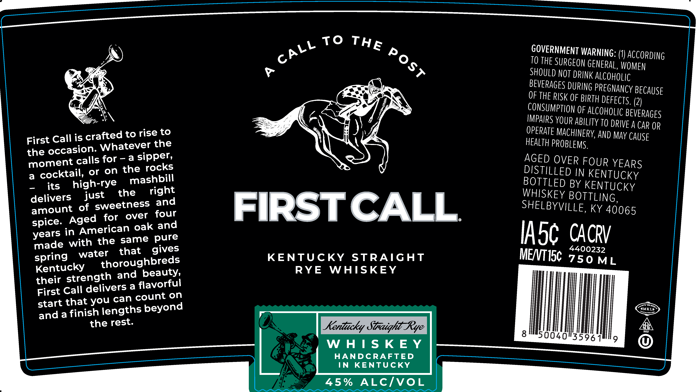

# TTB COLA Label Images - TTBID 26202001000201

**Brand Name:** FIRST CALL

**Issue Date:** 07/23/2026

**Origin Code:** 22

**Product Class/Type:** 102

**Source:** [TTB Public COLA Registry](https://ttbonline.gov/colasonline/viewColaDetails.do?action=publicFormDisplay&ttbid=26202001000201)

## Label Images

### Label 1

## Extracted Label Text

*Text extracted via OCR - may contain errors*

**Detected Proof:** 90

### Label 1

To
GOVERNMENT WARNING:
ACCORDING
TO THE SURGEON generAL, WOMEN
SHOULd NOT DRINK ALcoholic
BEVERaGeS DURUNG PREGNANCY BECAUSE
OF THe RISK OF BIRTH DEFEcts (23
COMSuMPTIon OF ALCOHoLIc BeveRages
OPaRs VOur ABILITY TO DrIVE A Car or
Call is crafted to rise to
OPERATE MACHINERY, AND May Cause
First
Whatever the
HeALTh PROBLEMS.
the occasion:
moment calls for
=
a
sipper,
AGED OVER FOUR YEARS
a
cocktail;
or
on the rocks
DISTILLED IN KENTUCKY
its
high-rye
mashbill
BOTTLED BY KENTUCKY
delivers
just
the
right
WHISKEY BOTTLING,
deloenf 0f sWeetoeer @
FIRSTCALL
SHELBYVILLE, KY 40065
for
over
ingenencaark @nd
Iasc CACRV
made with the same
water
that
KENTUCKY
STRAIGHT
MeNTISc 7 50M
Kentucky
thoroughbreds
RYE
WHSKEY
ML
tleir strength and beautyi
theit Galedelivers a flavorfon
start that
can count on
stdta finish lengths beyond
#MKLO
the
Kentucky Straight-Rye
352_
8
50040"35961
9
W H |S K E Y
HANDCRAFTED
IN
KENTUcKY
45 %
ALCIvoL
THE
CALL
Post
Aged
spice.
years
gives
spring
you
rest.
