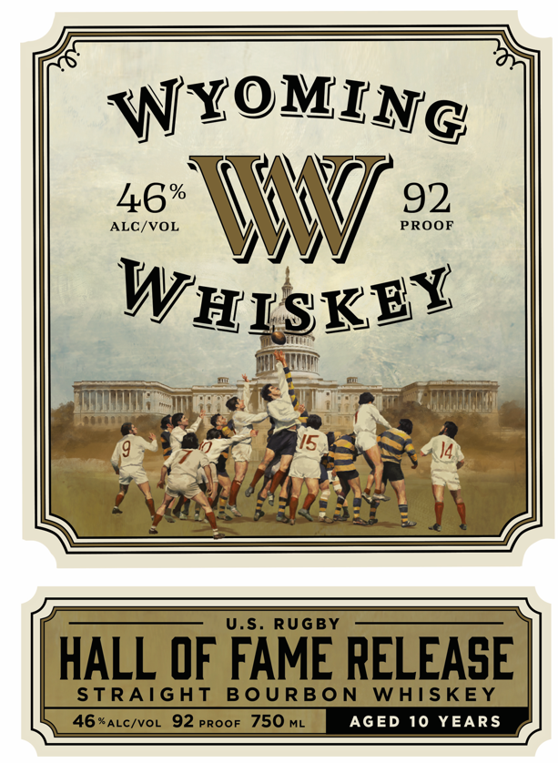
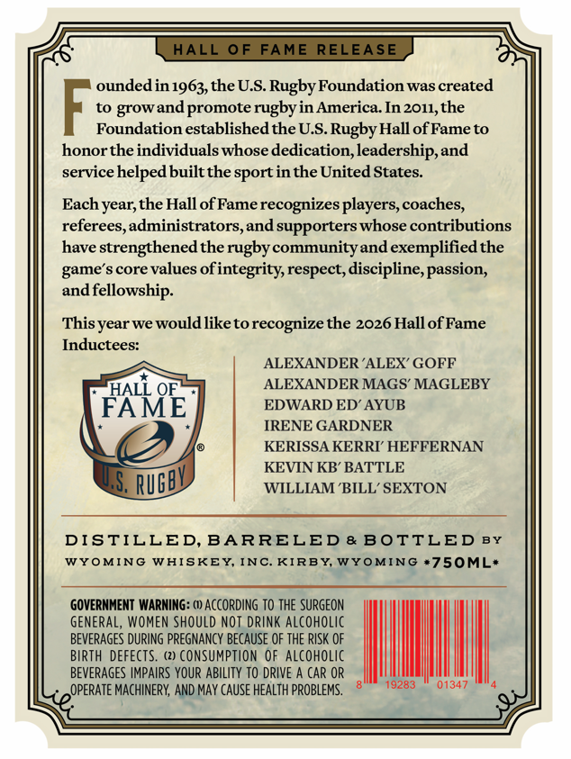
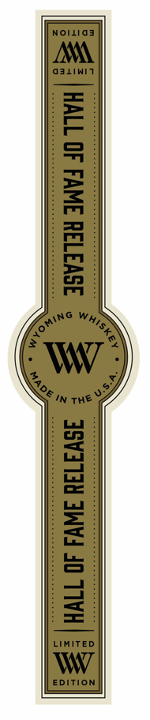

# TTB COLA Label Images - TTBID 26202001000452

**Brand Name:** WYOMING WHISKEY

**Fanciful Name:** HALL OF FAME RELEASE

**Issue Date:** 07/24/2026

**Origin Code:** 49

**Product Class/Type:** 101

**Source:** [TTB Public COLA Registry](https://ttbonline.gov/colasonline/viewColaDetails.do?action=publicFormDisplay&ttbid=26202001000452)

## Label Images

### Label 1

### Label 2

### Label 3

## Extracted Label Text

*Text extracted via OCR - may contain errors*

*1 image(s) excluded: text did not meet readability threshold*

**Detected Proof:** 92
**Detected Age:** 10 Years

### Label 1

WYoMING
ALC/VOL
46%
W
PROOF
92
WIISKEY
U.S
RUGBY
HALL OF FAME RELEASE
STRAIGHT
B0 URBON
WAISKEY
46*ALC/VOL
92 Proof 750 ML
AGED 10 YEARS

### Label 2

HALL
0F
FAME RELEASE
oundedin 1963,theU.S Rugby Foundation was created
to
and promote rugbyin America  In 2011,the
Foundation establishedthe U.S.Rugby Hall ofFame to
honorthe individuals whose dedication,leadership,and
service helped builtthe sportin the United States
Each year; the Hall ofFame recognizes players,coaches,
referees,administrators
and supporters whose contributions
have
'strengthened the rugbycommunityand exemplifiedthe
game' $ core values ofi
Fintegrity, respect,discipline, passion,
and
Ifellowship:
Thisyear we would like torecognize the 2026 Hall ofFame
Inductees:
ALEXANDER 'ALEX' GOFF
HALL OE
ALEXANDER MAGS' MAGLEBY
FAME
EDWARD ED AYUB
IRENE GARDNER
KERISSA KERRI' HEFFERNAN
KEVIN KB' BATTLE
S,
WILLIAM 'BILL' SEXTON
DISTILLED, BARRELED & BOTTLED BY
WYOMING
WHISKEY; INC_
KIRBY, WYOMING .750ML:
GOVERNMENT WARNING: () AcCoRDING TO ThE SURgeon
GENERAL, WOMEN ShOUld NOT DRINK Alcoholic
BEVERAGES DuRING PREGNANCY BECAUSE OF THE RiSk OF
BIRTH DEFECTS
(2) cOnsumption OF alcoholic
BEVERAGES IMPAIRS YOUR AbiLITY TO DRIVE A Car OR
OPERATE MACHINERY; AND May CAUSE HEAlTh PROBLEMS.
19283
01347
grow
RUGBV
