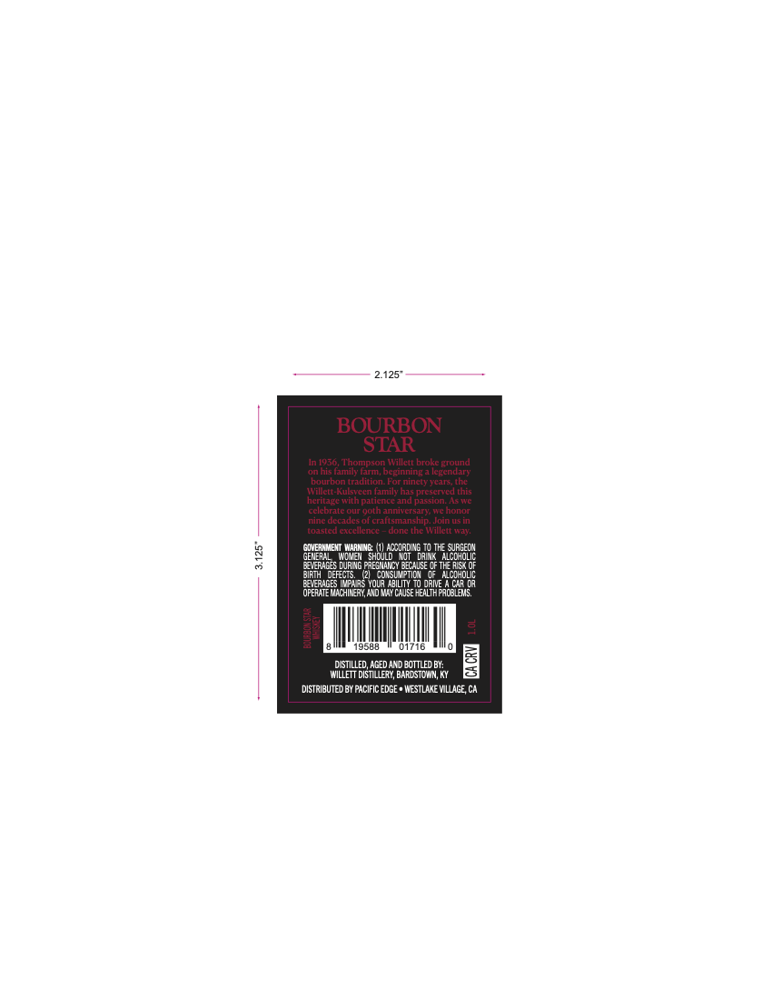
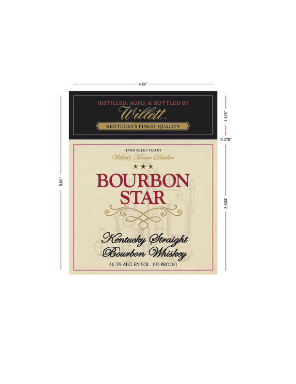
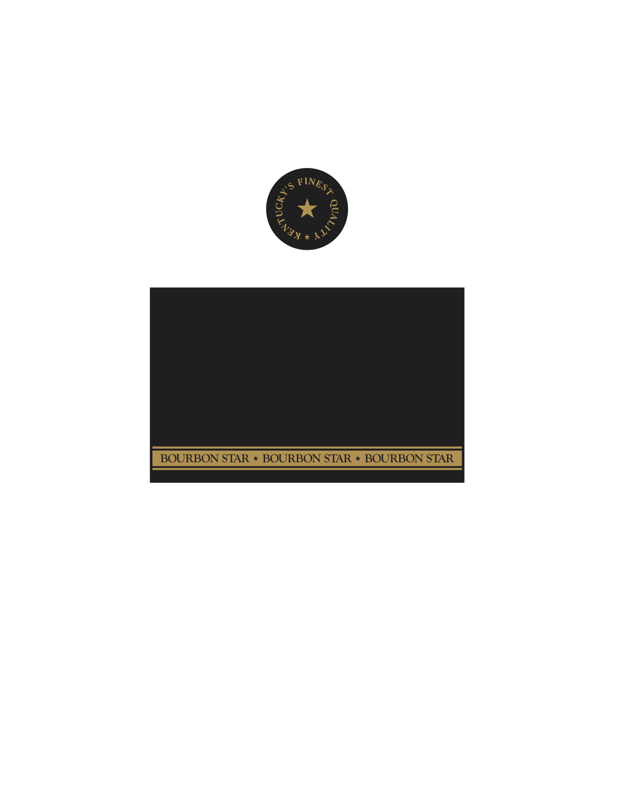

# TTB COLA Label Images - TTBID 26202001000457

**Brand Name:** BOURBON STAR

**Issue Date:** 07/24/2026

**Origin Code:** 22

**Product Class/Type:** 101

**Source:** [TTB Public COLA Registry](https://ttbonline.gov/colasonline/viewColaDetails.do?action=publicFormDisplay&ttbid=26202001000457)

## Label Images

### Back Label

### Label 1

### Label 3

## Extracted Label Text

*Text extracted via OCR - may contain errors*

**Detected Proof:** 93

### Back Label

BOURBON
STAR
In [956, Thompson Willett broke ground
on his family farm;
Defnningapentari
hourhoninditunaFonninetFLana
TV ilect-Kulsteen Family has preserved this
heritagt wvith paticnct and passion;
Stt
Cclcbrtc Oun uuthanntersari
onot
nine decades of craftsmanship
KErtirHSin
fDastedetchencr
Lu: tJWWOSK wa
0
GOVEAIMEMT WaaING
iocdadiNG
SURGELN
GENEM
acqHolic
Irlcs Lrg PaediLDlkuse oF
BIFIH
eruk
ColsL
Ic [Mciholic
Nrule
Wpias Yola Nbility
ORNVE
Cn (a
OFERATE Machikery andM7cause healthpacLEMS
8-
9588
01716
DTILLED, AGED AMD BOTTLED BY:
Willett dIsTILLeRY, BARDSTOWNN, Ky
DISTRIbUTed BY PACIFIC EDGE * HESTVIkE VillaGE, Ca

### Label 1

DISTILLED; AGED;
BOTTLED BY
Uidett
KENTUCKY"S FINEST QUALITY
0,275
IANu :FLECTED
CMillan: SMastcr Ofmller
BOURBON
STAR
@waight
Bourbon
46.5% ALC. BY VOL. (95 PKOOF)
GKentucky
OHhiskey

### Label 3

BOURBON STAR
BOURBON STAR
BOURBON STAR
FINES?
(
2
XLI"
