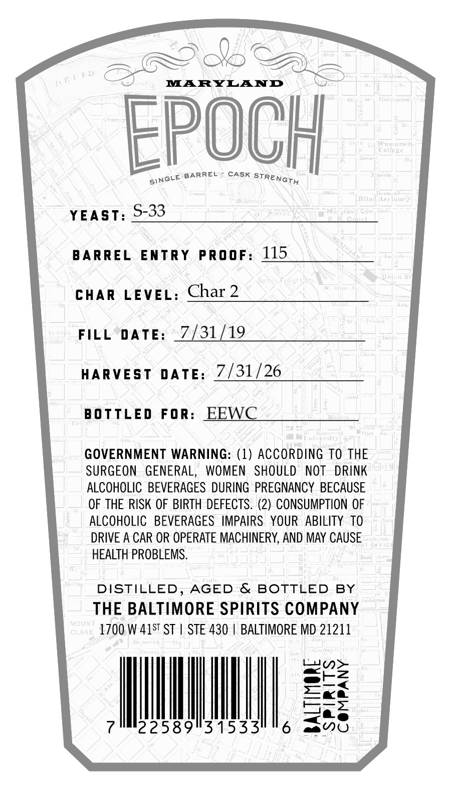
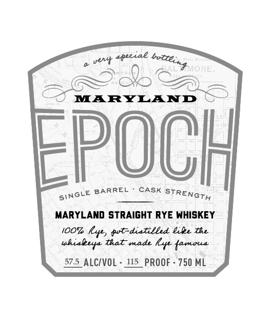

# TTB COLA Label Images - TTBID 26202001000520

**Brand Name:** EPOCH

**Issue Date:** 07/27/2026

**Origin Code:** 25

**Product Class/Type:** 102

**Source:** [TTB Public COLA Registry](https://ttbonline.gov/colasonline/viewColaDetails.do?action=publicFormDisplay&ttbid=26202001000520)

## Label Images

### Back Label

### Front Label

### Label 2

## Extracted Label Text

*Text extracted via OCR - may contain errors*

*1 image(s) excluded: text did not meet readability threshold*

**Detected Proof:** 115

### Back Label

Gob AS

MARYLAND

EPOCH

NGve BARREL CASK YT]

GBP

YEAST: 9°93

BARREL ENTRY PROOF: 115

CHAR LEVEL: Char 2

FILL DATE: 7/31/19

HARVEST DATE: 7/31/26

BOTTLED FOR: EEWC

GOVERNMENT WARNING: (1) ACCORDING TO THE
SURGEON GENERAL, WOMEN SHOULD NOT DRINK
ALCOHOLIC BEVERAGES DURING PREGNANCY BECAUSE
OF THE RISK OF BIRTH DEFECTS. (2) CONSUMPTION OF
ALCOHOLIC BEVERAGES IMPAIRS YOUR ABILITY TO
DRIVE A CAR OR OPERATE MACHINERY, AND MAY CAUSE
HEALTH PROBLEMS.

DISTILLED, AGED & BOTTLED BY
THE BALTIMORE SPIRITS COMPANY
1700 W 415" ST | STE 430 | BALTIMORE MD 21211

22589°31533

### Front Label

vevt 4peciae
MARYLAND
EpOCH
BARREL
CASK
MARYLAND strAIGHT RYE WHISKEY
iOOz
kye, fot-diatilbed &ile te
tal made
Lyne {amoua
575_ALCIVOL
415_PROOF
750 ML
botteint ORE:
STREnGTH
SINGLE
uhialer
