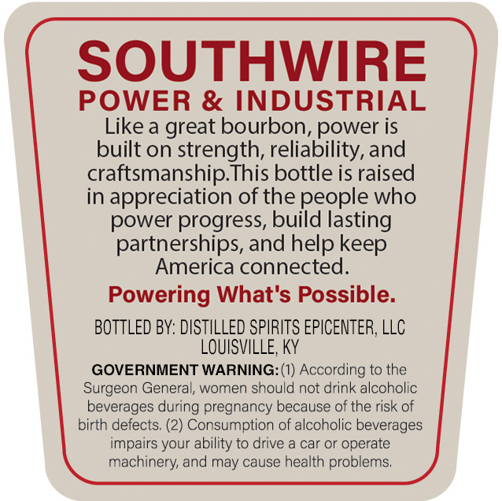
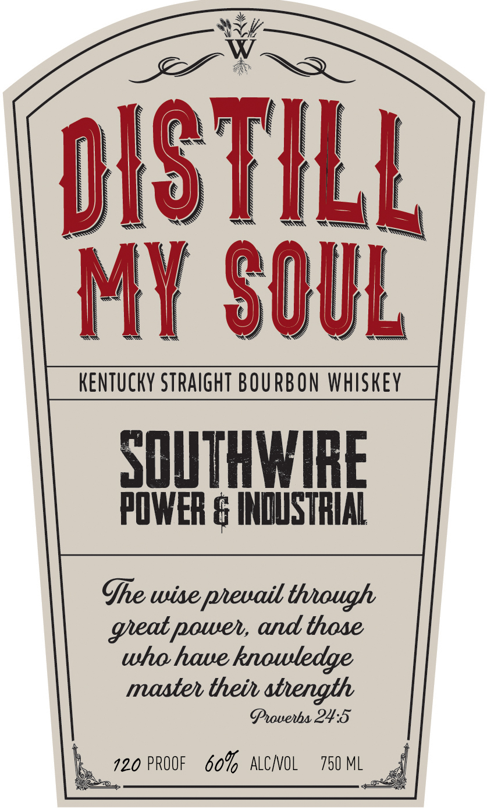

# TTB COLA Label Images - TTBID 26202001000628

**Brand Name:** DISTILL MY SOUL

**Issue Date:** 07/27/2026

**Origin Code:** 22

**Product Class/Type:** 101

**Source:** [TTB Public COLA Registry](https://ttbonline.gov/colasonline/viewColaDetails.do?action=publicFormDisplay&ttbid=26202001000628)

## Label Images

### Back Label

### Front Label

## Extracted Label Text

*Text extracted via OCR - may contain errors*

**Detected Proof:** 120

### Back Label

SOUTHWIRE
POWER & INDUSTRIAL
Like a
great bourbon, power is
built on strength, reliability, and
craftsmanship This bottle is raised
in
appreciation of the people who
power progress, build lasting
partnerships, and help
America connected:
Powering What's Possible:
BOTTLED BY: DISTILLED SPIRITS EPICENTER; LLC
LOUISVILLE; KY
GOVERNMENT WARNING: (1) According to the
Surgeon General, women should not drink alcoholic
beverages during pregnancy because of the risk of
birth defects; (2) Consumption of alcoholic beverages
impairs your ability to drive
car or
operate
machinery and may cause health problems;
keep

### Front Label

OSTKLL
MY SQUL
KENTUcKY StRAIgHT BOURBON whiskey
SQUTHMIBE
POWER & INDUSTRIAL
Ghe wise peuail though
poweh, and those
who haue _
knowledge
masteh theil atength
Ghouenhs 24*5
120 PROOF
609   ALCNOL
750 ML
geat
