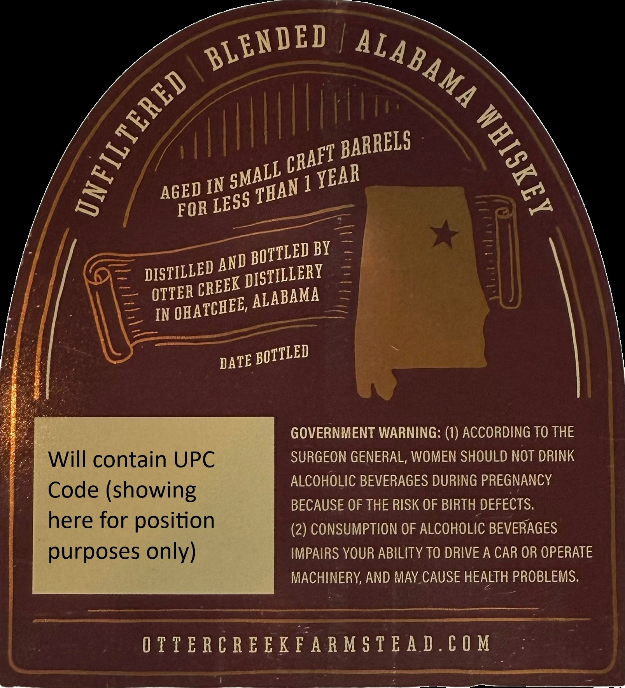
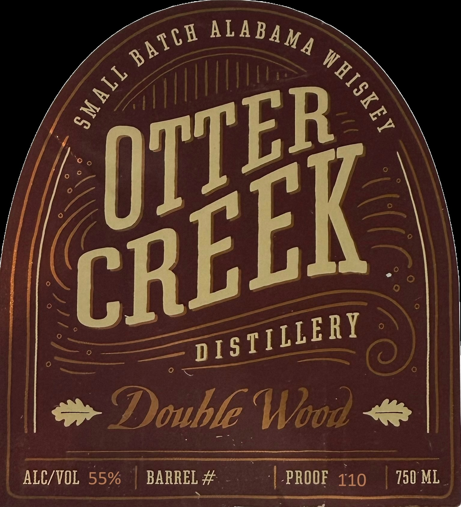

# TTB COLA Label Images - TTBID 26202001000648

**Brand Name:** OTTER CREEK DISTILLERY

**Fanciful Name:** SMALL BATCH ALABAMA WHISKEY, DOUBLE WOOD, BLENDED

**Issue Date:** 07/24/2026

**Origin Code:** 10

**Product Class/Type:** 140

**Source:** [TTB Public COLA Registry](https://ttbonline.gov/colasonline/viewColaDetails.do?action=publicFormDisplay&ttbid=26202001000648)

## Label Images

### Back Label

### Front Label

### Label 3

## Extracted Label Text

*Text extracted via OCR - may contain errors*

**Detected Proof:** 110

### Back Label

IN
1
BY
OTTER
IN
GOVERNMENT WARNING: (1) ACCORDING TO THE
Will contain UPC
SURGEON GENERAL, WOMEN SHOULD NOT DRINK
ALCOHOLIC BEVERAGES DURING PREGNANCY
Code (showing
BECAUSE OF THE RISK OF BIRTH DEFECTS.
here for position
(2) CONSUMPTION OF ALCOHOLIC BEVERAGES
purposes only)
IMPAIRS YOUR ABILITY TO DRIVE A CAR OR OPERATE
MACHINERY; AND MAY CAUSE HEALTH PROBLEMS:
0 T T E R C R E E K F A R M $ T E A D . € 0 M
BLENDED
ALABAMA
1
1
BARRELS
CRAFT
SMALL
YEAR
THAN
AGED
LESS
FOR
BOTTLED
AND
DISTILLED
DISTILLERY
CREEK
ALABAMA
OHATCHEE,
BOTTLED
DATE

### Front Label

4Double Wood
ALC/VOL
55%
BARREL #
PROOF
110
750 ML
ALABAMA
BACH
1
1
CBEEEL'
DIS TILLERY

### Label 3

as tLe I me

PROUDLY DISTILLED
DOWN SIX FOOT ROAD
