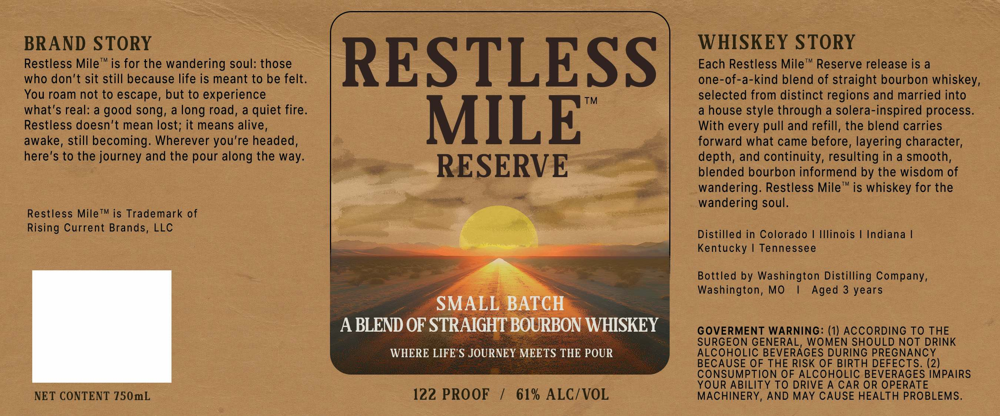

# TTB COLA Label Images - TTBID 26202001000659

**Brand Name:** RESTLESS MILE

**Issue Date:** 07/27/2026

**Origin Code:** 29

**Product Class/Type:** 129

**Source:** [TTB Public COLA Registry](https://ttbonline.gov/colasonline/viewColaDetails.do?action=publicFormDisplay&ttbid=26202001000659)

## Label Images

### Label 1

## Extracted Label Text

*Text extracted via OCR - may contain errors*

**Detected Proof:** 122

### Label 1

BRAND STORY
WHISKEY STORY
Restless Mile
TM
is for the wandering soul: those
RESTLESS
Each Restless Mile
TM
Reserve release is a
who don't sit still because life is meant to be felt.
one-of-a-kind blend of straight bourbon whiskey,
You roam not to escape, but to experience
TM
selected from distinct regions and married into
what'$ real: a good song, a long road, a quiet fire.
a house style through a solera-inspired process.
Restless doesn't mean lost; it means alive,
MILE
With every
and refill, the blend carries
awake, still becoming. Wherever
re headed,
forward what came before, layering character;
here's to the journey and the pour along the way:
depth; and continuity; resulting in a smooth,
RESERVE
blended bourbon informend by the wisdom of
Tm
wandering: Restless Mile
is whiskey for the
wandering soul.
Restless MileTM is Trademark of
Rising Current Brands, LLC
Distilled in Colorado
Illinois
Indiana
Kentucky
Tennessee
Bottled by Washington Distilling Company,
Washington, MO
Aged 3
SMALL BATCH
A BLEND OF STRAIGHT BOURBON WHISKEY
GOVERMENT WARNING: (1) ACCORDING TO THE
SURGEON GENERAL WOMEN SHOULD NOT DRINK
WHERE LIFE' $ JOURNEY MEETS THE POUR
ALCOHOLIC BEVERAGES DURING PREGNANCY
BECAUSE OF THE RISK OF BIRTH DEFECTS. (2)
CONSUMPTION OF ALCOHOLIC BEVERAGES IMPAIRS
YOUR ABILITY TO DRIVE A CAR OR OPERATE
NET CONTENT 750mL
122 PROOF
61% ALC/VOL
MACHINERY, AND MAY CAUSE HEALTH PROBLEMS.
pull
you'r
years
