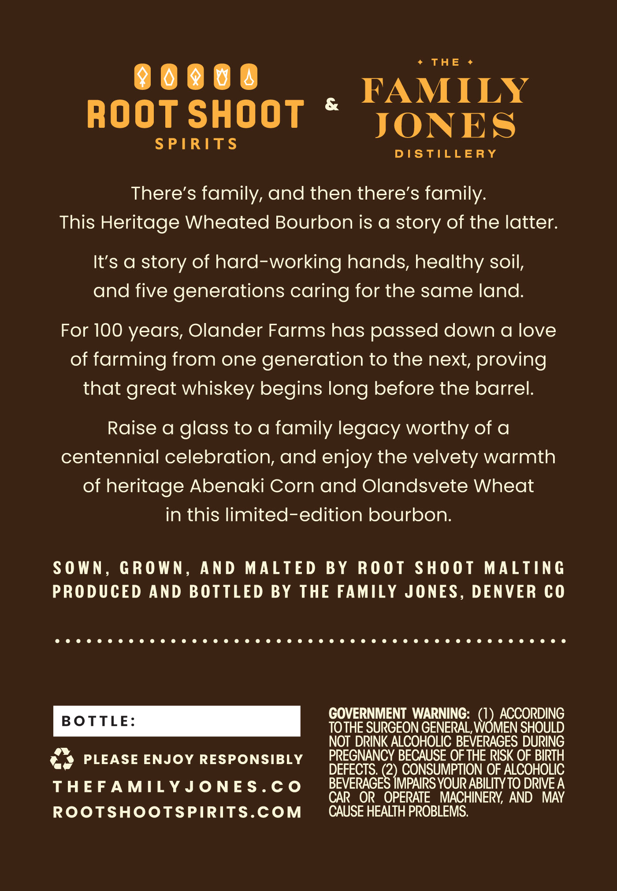
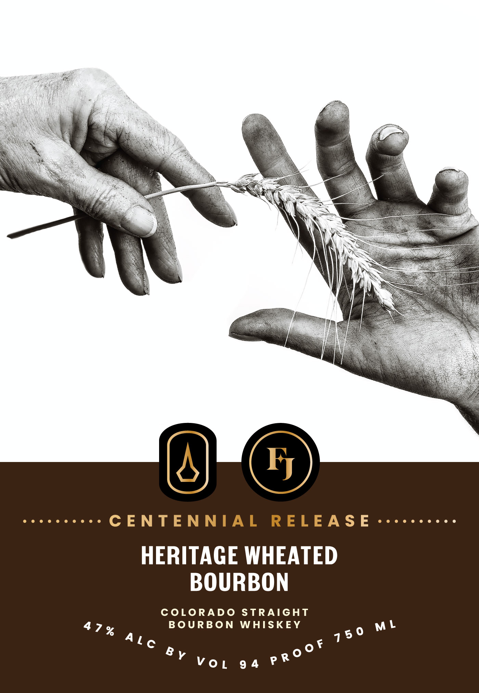

# TTB COLA Label Images - TTBID 26202001000763

**Brand Name:** CENTENNIAL RELEASE

**Issue Date:** 07/27/2026

**Origin Code:** 13

**Product Class/Type:** 101

**Source:** [TTB Public COLA Registry](https://ttbonline.gov/colasonline/viewColaDetails.do?action=publicFormDisplay&ttbid=26202001000763)

## Label Images

### Back Label

### Front Label

## Extracted Label Text

*Text extracted via OCR - may contain errors*

### Back Label

* THE +

86868

FAMILY

ROOT SHOOT *

JONES

SPIRITS

DISTILLERY

There’s family, and then there’s family.

This Heritage Wheated Bourbon is a story of the latter

It’s a story of hard-working hands, healthy soil,

and five generations caring for the same land.

For 100 years, Olander Farms has passed down a love

of farming from one generation to the next, proving

that great whiskey begins long before the barrel.

Raise a glass to a family legacy worthy of a

centennial celebration, and enjoy the velvety warmth

of heritage Abenaki Corn and Olandsvete Wheat

in this limited-edition bourbon.

SOWN, GROWN, AND MALTED BY ROOT SHOOT MALTING

PRODUCED AND BOTTLED BY THE FAMILY JONES, DENVER CO

eoceeeecececececeoeeee eco ee eee eee ee eee eee eeeeeeeeeeeeeee

GOVERNMENT WARNING: (1) ACCORDING

TOTHE SURGEON GENERAL, WOMEN SHOULD

NOT DRINK ALCOHOLIC BEVERAGES DURING

z

«

@

PLEASE ENJOY RESPONSIBLY

DEFECTS. (2

PREGNANCY BECAUSE OF THE RISK OF BIRTH

CONSUMPTION OF ALCOHOLIC

THEFAMILYJONES.CO

BEVERAGE

IMPAIRS YOUR ABILITY TO DRIVE A

R OR OPERATE MACHINERY, AND MAY

ROOTSHOOTSPIRITS.COM

CAUSE HEALTH PROBLEMS.

### Front Label

CENTENNIAL RELEASE

HERITAGE WHEATED
BOURBON

COLORADO STRAIGHT
474% BOURBON WHISKEY

Alo of

(e]
Y vor 94 PF
