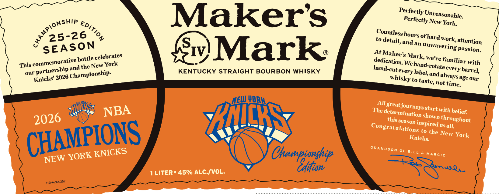
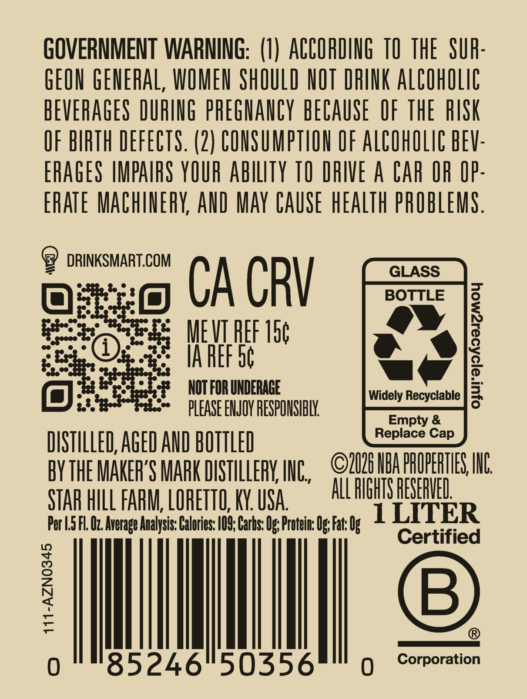

# TTB COLA Label Images - TTBID 26202001000843

**Brand Name:** MAKER'S MARK

**Issue Date:** 07/27/2026

**Origin Code:** 22

**Product Class/Type:** 101

**Source:** [TTB Public COLA Registry](https://ttbonline.gov/colasonline/viewColaDetails.do?action=publicFormDisplay&ttbid=26202001000843)

## Label Images

### Label 1

### Label 2

## Extracted Label Text

*Text extracted via OCR - may contain errors*

**Detected Proof:** 90

### Label 1

Makers
York
25-26
to
and
work,attention
an
celebrates
IV;
Mark
At
passion.
we're
This
and the New York
We_
with
KENTUCKY STRAIGHT BOURBON WHISKY
and
Knicks'
to
age our
not
LVQR
All great
'determinatioyshtart with belief:
RNICRS
this _
inspired us all
to the New
Knicks:
0F BILL
NEW
 Ohamtimoghp
U
1 LITER
45% ALC IVOL:
110-
AZNO357
Perfectly
Unreasonable:
Perfectly
New
cmampionshia
Edition
Countless
hours =
ofhard
detail,
SEASON
unwavering
Maker' s"
Mark,
bottle
dedication.
familiar-
commemorative
hand-rotate
hand-cut =
every
partnership
barrel,
every
label,
Championship:
our
always =
2026
whisky
taste,
time.
NEW
XnckS
journeys
NBA
The :
2026
shown
throughout
season
CHAMPIONS
Congratulations
York
GRanDSon
KNICKS
YORK
MaRGIe

### Label 2

GOVERNMENT WARNING: (U) ACCORDING TO THE   SUR:
GEON GENERAL, WOMEN ShOULD NOT DRINK AlCOhOLig
BEVERAGES DURING phEGNANCY beCauSe  OF thE  RISK
OF BIRTH DEFECTS. (2 } CONSUMPTION OF ALCOhOLIC BEV:
ERAGES MPAIFS YOUR abilTy TO DRIVE A CAr OR IP:
ERATE MaChinErY, AND May CAUSE hEaLTh pROBLEMS .
DRINKSMART.COM
GLASS
CA CRV
BOTTLE
MEVI HEF 15c
IA REF 56
7
NOT FOR UNDERAGE
Widely Recyclable
PLEASE ENJOY RESPONSIBLY
Empty &
Replace
DISTILLED,AGED AND BOTTLED
BYTHE MAKER'S MaRK DISTHLLERK, ING,
2U26 HBA PPOPEHTLES; IUL
STAR HILL FABM; LOHETTO; KY. USA
All PIGHTS PESERHEL
Per L.5 FL Oz Average Analysis: Calories: /09; Carbs: Os; Protein: Os; Fat: Ug
1LITER
Certified
1
B
0
85246"50356
Corporation
Cap
