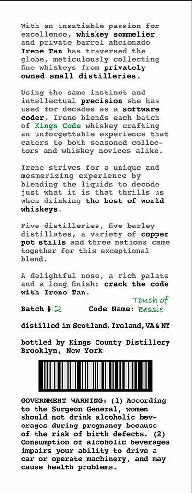
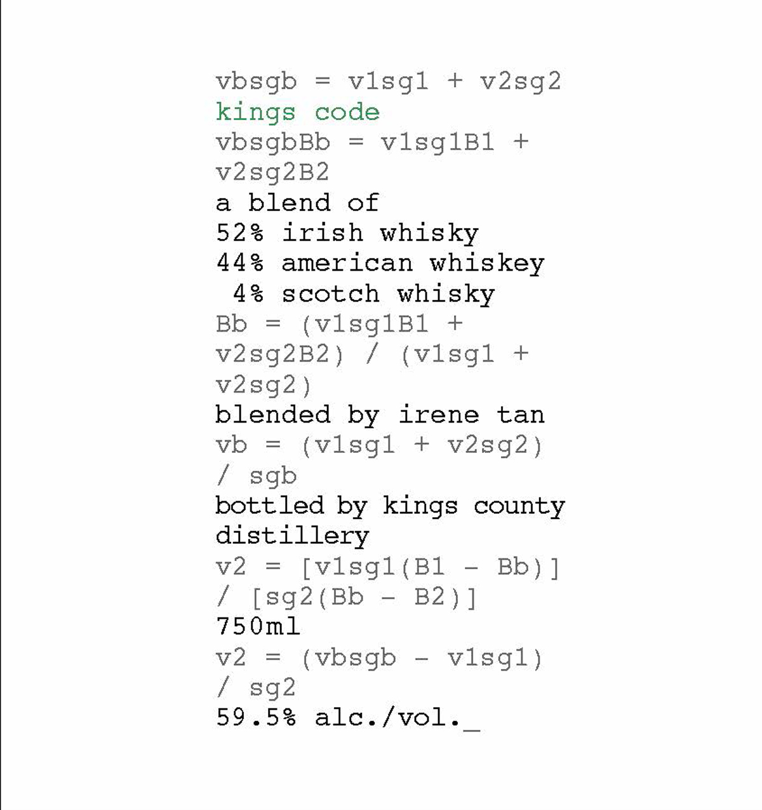

# TTB COLA Label Images - TTBID 26202001000848

**Brand Name:** KINGS CODE

**Issue Date:** 07/27/2026

**Origin Code:** 02

**Product Class/Type:** 140

**Source:** [TTB Public COLA Registry](https://ttbonline.gov/colasonline/viewColaDetails.do?action=publicFormDisplay&ttbid=26202001000848)

## Label Images

### Back Label

### Front Label

## Extracted Label Text

*Text extracted via OCR - may contain errors*

### Back Label

With
an
insatiable passion
for
excellence, whiskey
sommelier
and private
barrel
aficionado
Irene
has
traversed
the
globe
meticulously collecting
fine whiskeys
from privately
owned
small
distilleries
Using
the
same
instinct
and
intellectual
precision
she
has
used
for
decades
as
software
coder
Irene
blends
each
batch
of Kings
Code
whiskey
crafting
an  unforgettable
experience
that
caters
to
both
seasoned
collec-
tors
and whiskey
novices
alike_
Irene
strives
for
unique
and
mesmerizing experience
by
blending
the
liquids
to
decode
just
what
it
is
that
thrills
uS
When
drinking
the
best
of
world
whiskeys
Five
distilleries
five barley
distillates
variety
of
copper
pot stills and
three nations
came
together
for
this
exceptional
blend
delightful
nose ,
a rich palate
and
finish:
crack
the
code
with
Irene
Tan
Touch
of
Batch
Code
Name :
Bessie
distilled
in Scotland, Ireland, VA & NY
bottled by Kings
County Distillery
Brooklyn ,
New
York
GOVERNMENT
WARNING :
(1)
According
to
the Surgeon
General
women
should
drink
alcoholic bev-
erages during pregnancy
because
of
the
risk
of birth
defects.
(2)
Consumption
of
alcoholic beverages
impairs
your ability
to
drive
car
or
operate machinery
and may
cause health
problems _
Tan
long
not

### Front Label

vbsgb
vlsgl
+
v2sg2
kings
code
vbsgbBb
vlsglBl
+
v2sg2B2
a
blend
of
528
irish whisky
449
american whiskey
48 scotch whisky
Bb
(vlsglBl
v2sg2B2 )
(vlsgl
+
v2sg2 )
blended
irene
tan
vb
=
(vlsgl
+
v2sg2 )
sgb
bottled by kings county
distillery
v2
[vlsgl (Bl
Bb ) ]
1 [s92
Bb
75 0ml
v2
(vbsgb
vlsgl )
1
59 . 58
alc./vol .
by
B2 ) ]
sg2
