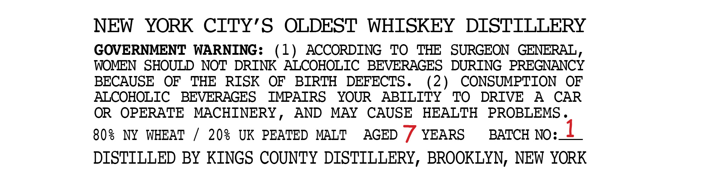

# TTB COLA Label Images - TTBID 26202001000850

**Brand Name:** KINGS COUNTY DISTILLERY

**Fanciful Name:** DIAMOND HANDS

**Issue Date:** 07/27/2026

**Origin Code:** 02

**Product Class/Type:** 140

**Source:** [TTB Public COLA Registry](https://ttbonline.gov/colasonline/viewColaDetails.do?action=publicFormDisplay&ttbid=26202001000850)

## Label Images

### Back Label

## Extracted Label Text

*Text extracted via OCR - may contain errors*

### Back Label

NEW
YORK CITY'S
OLDEST WHTSKEY
DISTTLLERY
GOVERNMENT
WARNING:
1)
ACCORDING
TO
TF
SURGEON  GENERAL ,
WOMEN  SHOULD NOT DRINK ALCOHOLIC BEVERAGES
DURING  PREGNANCY
BECAUSE
OF
THE
RISK
OF
BIRTH
DEFECTS _
(2)
CONSUMPTION
OF
ALCOHOLIC
BEVERAGES
IMPATRS
YOUR
ABILITY
TO
DRIVE
A
CAR
OR
OPERATE
MACHINERY
AND
MAY
CAUSE
HEALTH
PROBLEMS
80s
NY
WHEAT
208
UK PEATED
MALT
AGED
YEARS
BATCH NO:1
DISTILLED BY KINGS COUNTY DISTILLERY, BROOKLYN, NEW YORK
