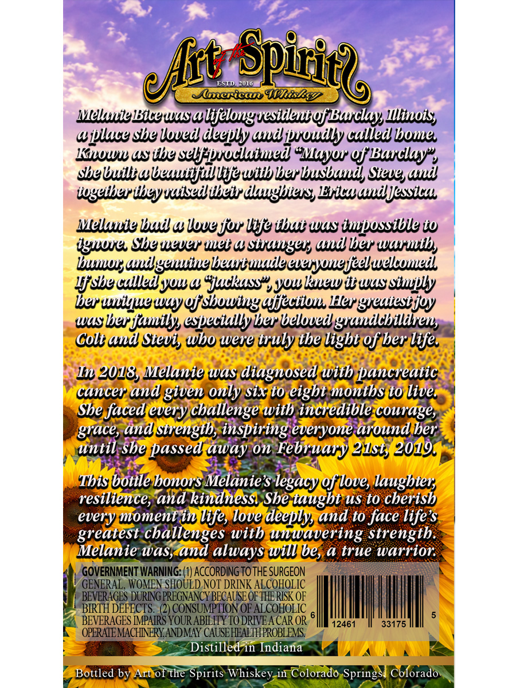
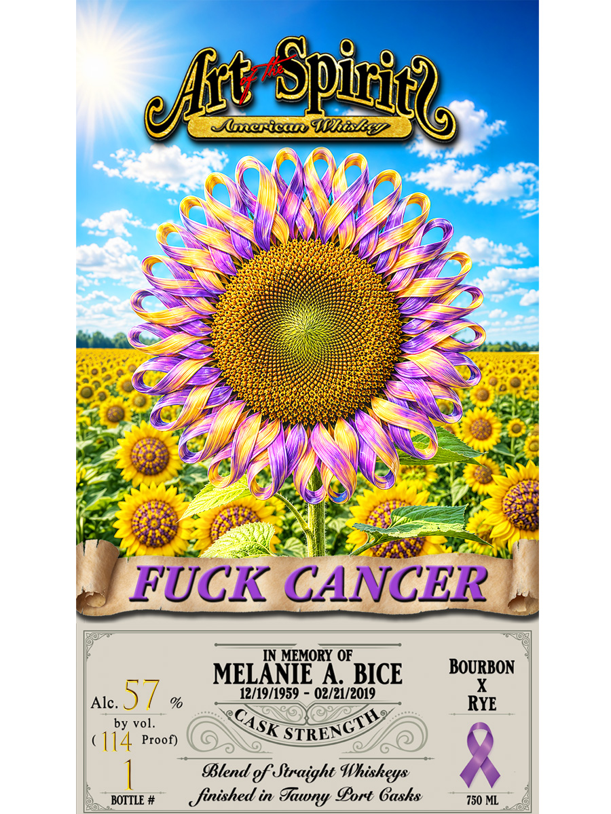

# TTB COLA Label Images - TTBID 26203001000009

**Brand Name:** ART OF THE SPIRITS AMERICAN WHISKEY

**Fanciful Name:** MELANIE A BICE

**Issue Date:** 07/24/2026

**Origin Code:** 13

**Product Class/Type:** 129

**Source:** [TTB Public COLA Registry](https://ttbonline.gov/colasonline/viewColaDetails.do?action=publicFormDisplay&ttbid=26203001000009)

## Label Images

### Back Label

### Front Label

## Extracted Label Text

*Text extracted via OCR - may contain errors*

**Detected Proof:** 114

### Back Label

ESTD
2015
Aunerican 4hiSLgD
MelluudeBicewas alifelonguesidentefBaclay Ilinois;
@jllace sbe loved deeply audjunudly calledbone
Kiluwl4s ibe selfpuclaiued "Mayor Uf Banclay y
shebuilabeuuiifullifewitb berbusband, Sievesand
igeiberibeyuaisedlibeir daughbies; Evicaaudlessica
Melande bud 4 lovefor life ihui was impossible io
igluue Sbe nleuer Ilei 4 Sbrungel; undlber wurmutby
bunlr;aldgeuinebeauiuudeeuersunefeelwelcuwed
Isbeculledyuwa "juckuss"svuwklew iwassiujly
ber uiquuewayeshowingajjeciiul Hergveaiesijoy
wasberfanilys especiallyhbet beloved grandchildren,
Colt and Sievi, wbo were iruly the light of ber life
In 2018, Melanie Was diagnosed with pancreatic
cuncer and given Only Six t0 eight months to live
She faced every challenge with incredible courage,
grace, and sirength, inspiring everyone aroundber
until She jassed away on February gJs1,2019.
Thisbottle bonors Melanie $ legacyeffloves laughier;
resilience, and kindnesst She taught uS t0 cherish
moment in life, love deeplys and t0 face life $
greatest cballenges with unwavering strength.
Melanie was,and
always Will be,a true warrior
GOVERNMENT WARNING: (1) ACCORDING TOTHE SURGEON
GENERAL, WOMEN SHOULD NOT DRINK ALCOHOLIC
BEVERAGES DURING PREGNANCY BECAUSE OF THEE RISK OF
BIRTH DEFECTS
(2) CONSUMPTION OF ALCOHOLIC
BEVERAGES MMPAIRS YOUR ABILITY TO DRIVEA CAR OR
12461
33175
OPERATEMACHNERYANDMAY CAUSEHEALTHPROBLEMS:
Distilled in Indiana
Bottled by Artof the Spirits Whiskey in Colorado Springs
Colorado
'SpiritG
elht
every

### Front Label

~lesican IKiSEgV
FUCK CANCER
IN MEMORY OF
MELANTE A BICE
BOURBON
Alc.
57
%
12/19/1959
02/21/2019
RYE
by vol.
114 Proof)
BBlend gf Straight Whisheys
BOTTLE #
finished in
Sort Gasks
750 ML
SpiriG
eJht
nl
CASK
STRENCTH
Iaryy
