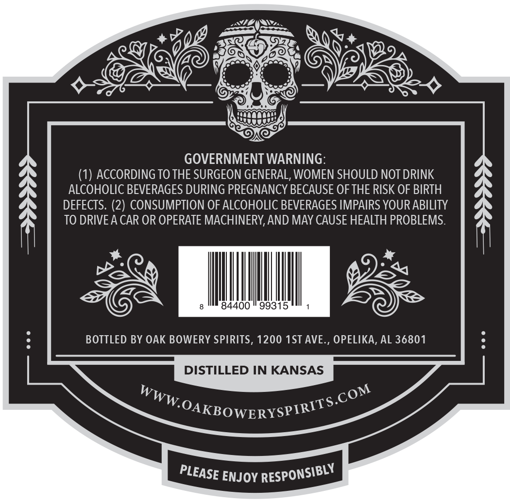
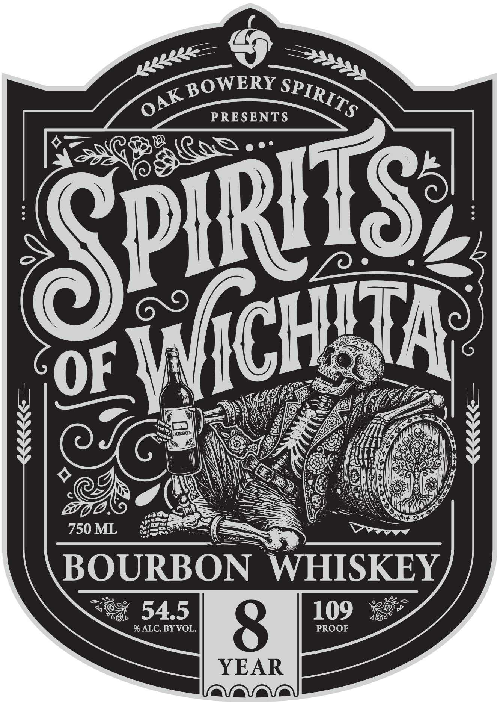

# TTB COLA Label Images - TTBID 26203001000022

**Brand Name:** SPIRITS OF WICHITA

**Issue Date:** 07/24/2026

**Origin Code:** 10

**Product Class/Type:** 101

**Source:** [TTB Public COLA Registry](https://ttbonline.gov/colasonline/viewColaDetails.do?action=publicFormDisplay&ttbid=26203001000022)

## Label Images

### Back Label

### Front Label

## Extracted Label Text

*Text extracted via OCR - may contain errors*

### Back Label

GOVERNMENT WARNING:
(1) ACCORDING TO THE SURGEON GENERAL, WOMEN SHOULD NOT DRINK
ALCOHOLIC BEVERAGES DURING PREGNANCY BECAUSE OF THE RISK OF BIRTH
DEFECTS. (2) CONSUMPTION OF ALCOHOLIC BEVERAGES IMPAIRS YOUR ABILITY
TO DRIVEA CAR OR OPERATE MACHINERY,AND MAY CAUSE HEALTH PROBLEMS.
84400
99315
BOTTLED BY OAK BOWERY SPIRITS, 1200 1ST AVE., OPELIKA, AL 36801
DISTILLED IN KANSAS
WWW OAKBOWERYSPIRITS
ENJOY
.COM
RESPONSIBLY
PLEASE

### Front Label

4
Gp
~% BOWERY Sp TR
OF rassents NS
Oni : ITS i
OF i 1CH A
y | a Nancie CA
PINNING Nai TY fof ype
ee) wien be
750 ML Saale Sane
BOURBON WHISKEY
S8% 5.4.5 8 109
% ALC. BY VOL. PROOF
YEAR
a\a\a\Va
