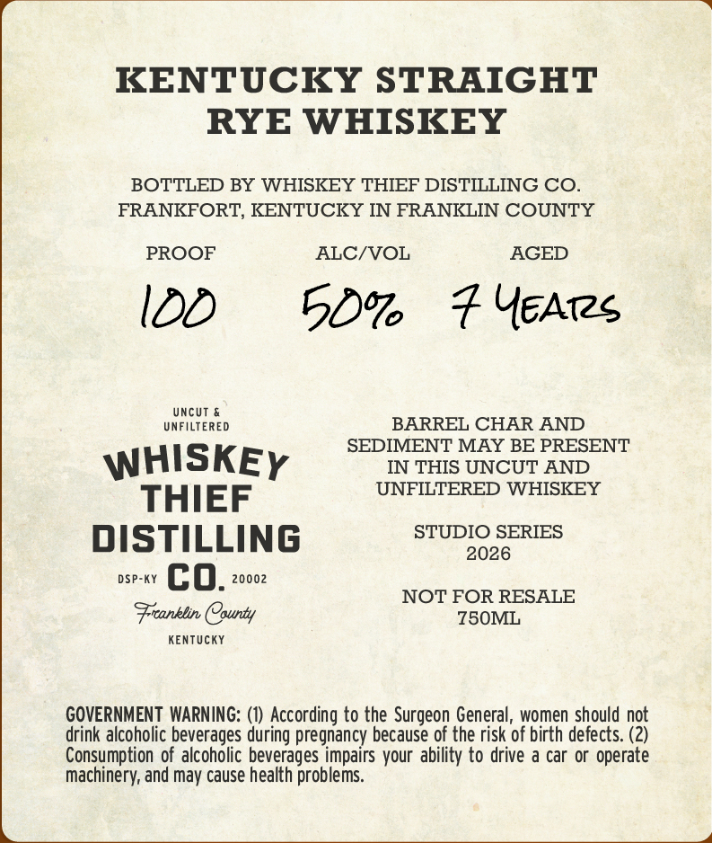
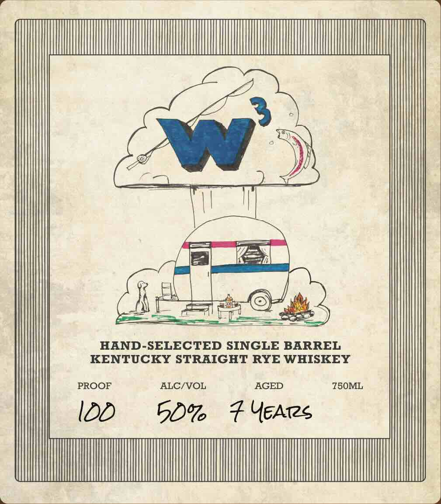

# TTB COLA Label Images - TTBID 26203001000151

**Brand Name:** WHISKEY THIEF DISTILLING CO.

**Fanciful Name:** W3

**Issue Date:** 07/27/2026

**Origin Code:** 22

**Product Class/Type:** 102

**Source:** [TTB Public COLA Registry](https://ttbonline.gov/colasonline/viewColaDetails.do?action=publicFormDisplay&ttbid=26203001000151)

## Label Images

### Back Label

### Front Label

## Extracted Label Text

*Text extracted via OCR - may contain errors*

### Back Label

KENTUCKY STRAIGHT
RYE WHISKEY
BOTTLED BY WHISKEY THIEF DISTILLING CO.
FRANKFORT, KENTUCKY IN FRANKLIN COUNTY
PROOF ALC/VOL AGED
I0D =50% =F Yeates
UNCUT &
UNFILTERED BARREL CHAR AND
Ss SEDIMENT MAY BE PRESENT
WHISKEy IN THIS UNCUT AND
TH I E F UNFILTERED WHISKEY
STUDIO SERIES
DISTILLING aa
vr CO. NOT FOR RESALE
Franklin Cpunty 7S0ML
KENTUCKY
GOVERNMENT WARNING: (1) According to the Surgeon General, women should not
drink alcoholic beverages during pregnancy because of the risk of birth defects. (2)
Consumption of alcoholic beverages impairs your ability to drive a car or operate
machinery, and may cause health problems.

### Front Label

M
HAND-SELECTED SINGLE BARREL
KENTUCKY STRAIGHT RYE WHISKEY
PROOF
ALCIVOL
AGED
750ML
IDD
50%6
YEATs
