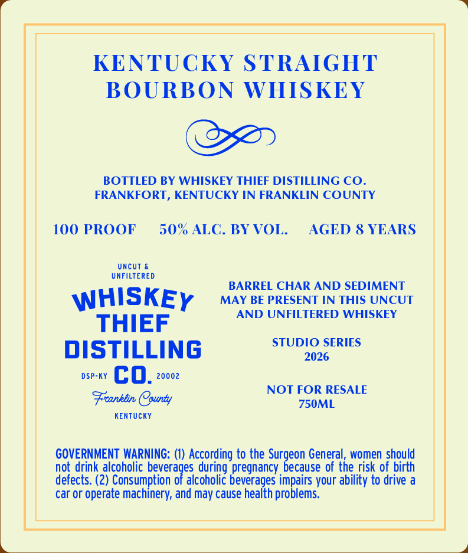
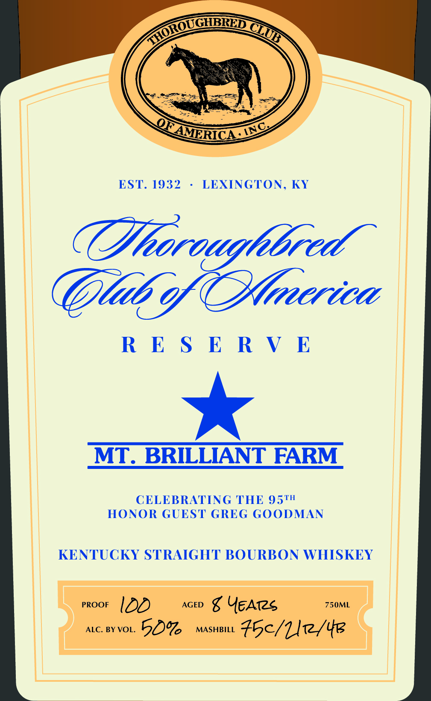

# TTB COLA Label Images - TTBID 26203001000155

**Brand Name:** WHISKEY THIEF DISTILLING CO.

**Fanciful Name:** THOROUGHBRED CLUB

**Issue Date:** 07/27/2026

**Origin Code:** 22

**Product Class/Type:** 101

**Source:** [TTB Public COLA Registry](https://ttbonline.gov/colasonline/viewColaDetails.do?action=publicFormDisplay&ttbid=26203001000155)

## Label Images

### Back Label

### Front Label

## Extracted Label Text

*Text extracted via OCR - may contain errors*

**Detected Proof:** 100

### Back Label

KENTUCKY STRAIGHT
BOURBON WHISKEY
BOTTLED BY WHISKEY THIEF DISTILLING CO_
FRANKFORT , KENTUCKY IN FRANKLIN COUNTY
100 PROOF
50% ALC. BY VOL_
AGED & YEARS
UncUT
UNFILTERED
BARREL CHAR AND SEDIMENT
WHISKEY
MAY BE PRESENT IN THIS UNCUT
AND UNFILTERED WHISKEY
THIEF
STUDIO SERIES
DISTILLING
2026
DSP-KY
co.
20002
NOT FOR RESALE
Franblin Caunty
750ML
KEnTUcKY
GOVERNMENT WARNING:
According to the Surgeon General, women should
not drink alcoholic beverages during pregnancy because of the risk of birth
defects. (2) Consumption of alcoholic beverages impairs your ability to drive a
car or operate machinery; and may cause health problems.

### Front Label

ks

OU

GHBRED a >

wg

EST. 1932

LEXINGTON, KY

Dtorougltbred

Glib of erica

RESERVE

MT. BRILLIANT FARM

CELEBRATING THE 95™

HONOR GUEST GREG GOODMAN

KENTUCKY STRAIGHT BOURBON WHISKEY

PROOF l LOD

AGED g Yeates

750ML

ALC. BY VOL. 5O% MASHBILL F5¢/Lle/4e
