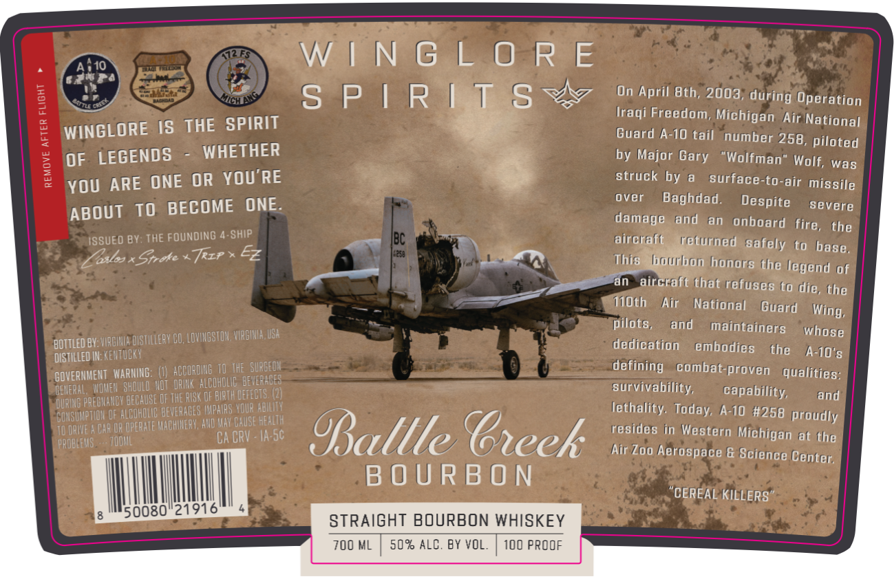

# TTB COLA Label Images - TTBID 26203001000182

**Brand Name:** WINGLORE SPIRITS

**Fanciful Name:** BATTLE CREEK BOURBON

**Issue Date:** 07/27/2026

**Origin Code:** 05

**Product Class/Type:** 101

**Source:** [TTB Public COLA Registry](https://ttbonline.gov/colasonline/viewColaDetails.do?action=publicFormDisplay&ttbid=26203001000182)

## Label Images

### Label 1

## Extracted Label Text

*Text extracted via OCR - may contain errors*

**Detected Proof:** 100

### Label 1

AR1O
Hntuo
W | N G L 0 R E
Ed
1
cHL
S P | R ( T $
On April Bth; 2003; during Operation
SPIRIT
Iraqi Freedom, Michigan Air National
WINGLORE IS THE
Guard A-10 tail   number 258,
piloted
OF LEGENDS
WHETHER
by Major Gary
"Wolfman'
Wolf, was
You ARE ONE OR YOU'RE
struck by
surface-to-air missile
to BECOME ONE:
over
Baghdad.
Despite
severe
ABOUT
damage
and
an  onboard
ISSUED BY: THE FOUNDING 4-SHIP
IBc
aircrff6
refurned
the
safely (0
xStroke
Trip * Ez
Fsa
This
hotrbon
honors {he legend of
an
aircrafk chat refuses (0 die, (he
Th@ch
Air
National
Guard
WIRGTIE , USR
pilots,
and
maintainers
whose
Bottled BV: VURGHUA DISIILLERY BO,LOVIHESTOH
dedicatfon
embodies
DSTILLED IN; KEHTUCky
thhe
A-10"$
BOVERHMEHT WARMING:
ACCORDIE T0 THE. SurGEOH=
defining
combat-proven
qualities:
BowerhmEhey BhDud VOt Dann #LGOHOLM BEVPneeR
survivability
capability,
{ PRFCHAREY BECAUSE OF THE RUSk OF BUTh DefeCts (21
and
~BURBI pTFBU OF ArOhonE BEVEBADES Wphrs VUA HAUlh
Tethality.
A-10 #258 proudly
TU @PME
GaR O OpERate WagHeRY; HHD Wav OAUSE HealTh
resides fn Western
PROULEMS
TOOML
Ca CRV . Ia-sC
Oallle BGreek
Michigan at (he
Afr Zoo Aerospace G Science Center;
B O U R B 0 N
"CEREAL KILLERS"
50080"21916
STRAIGHT BOURBON WHISKEY
700 ML
509 ALC, BY VOL,
100 PROOF
Rucad
1
[
fire ,
base,
Zest5
Wing,
Today,
