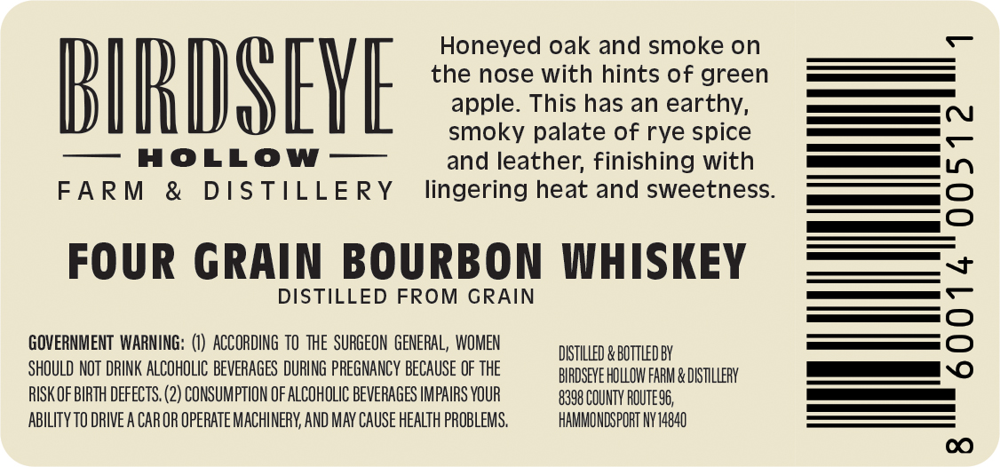
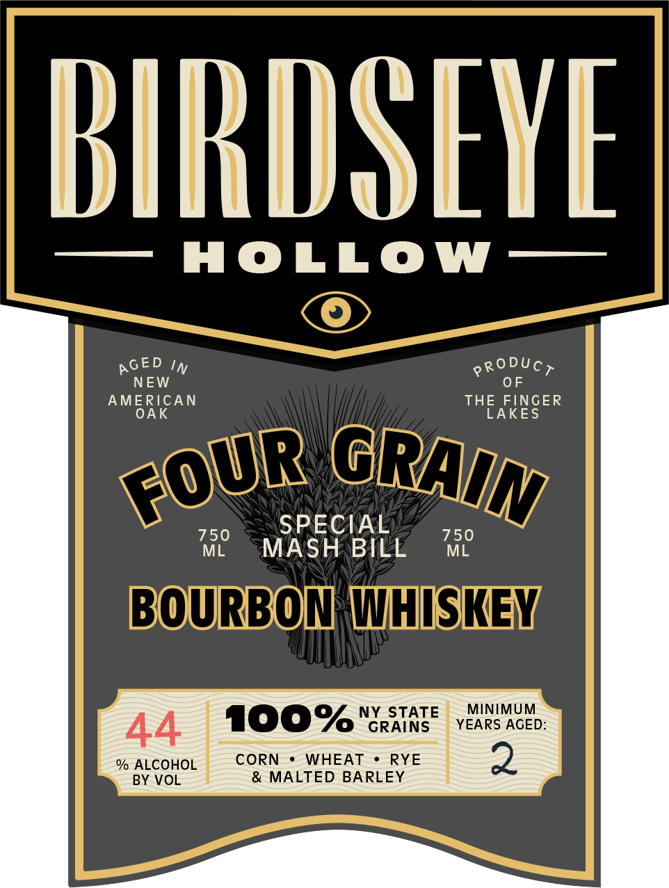
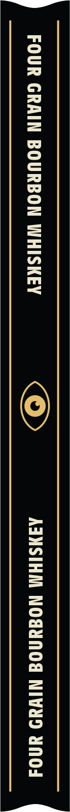

# TTB COLA Label Images - TTBID 26203001000355

**Brand Name:** BIRDSEYE HOLLOW

**Fanciful Name:** FOUR GRAIN BOURBON WHISKEY

**Issue Date:** 07/27/2026

**Origin Code:** 02

**Product Class/Type:** 101

**Source:** [TTB Public COLA Registry](https://ttbonline.gov/colasonline/viewColaDetails.do?action=publicFormDisplay&ttbid=26203001000355)

## Label Images

### Back Label

### Front Label

### Label 3

## Extracted Label Text

*Text extracted via OCR - may contain errors*

### Back Label

Honeyed oak and smoke on

the nose with hints of green

apple. This has an earthy,

BIRD SEYE

—o co!

smoky palate of rye spice

————

— HOLLOW —

and leather, finishing with

[Es |

FARM & DISTILLERY

lingering heat and sweetness

ee

_——>)

FOUR GRAIN BOURBON WHISKEY

DISTILLED FROM GRAIN

eS

GOVERNMENT WARNING: (1) ACCORDING TO THE SURGEON GENERAL, WOMEN

DISTILLED & BOTTLED BY

SHOULD NOT DRINK ALCOHOLIC BEVERAGES DURING PREGNANCY BECAUSE OF THE

BIRDSEVE HOLLOW FARM & DISTILLERY

a

RISK OF BIRTH DEFECTS. (2) CONSUMPTION OF ALCOHOLIC BEVERAGES IMPAIRS YOUR

8398 COUNTY ROUTES6,

HAMMONDSPORT NY 14840

ABILITY TO DRIVE A CAR OR OPERATE MACHINERY, AND MAY CAUSE HEALTH PROBLEMS.

### Front Label

BIRDSEYE
holLOW
IN
PRODUCT
NEW
0F
AMERICAN
THE FINGER
OAK
LAKES
750
SPECIAL
750
ML
MASH BILL
ML
BOURBOT [THISKEY
NY
STATE
MINIMUM
44
100%
GRAINS
YEARS AGED:
% ALCOHOL
CORN
WHEAT
RYE
2
BY VOL
& MALTED BARLEY
AGED
FOUR
GRAIN

### Label 3

FOUR GRAIN BOURBON WHISKEY Oy AINSIHM NO@INOd NIWAD YNnod
