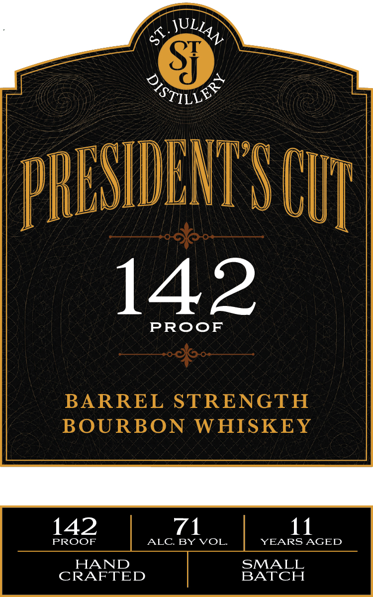
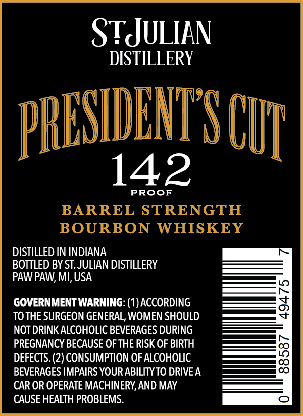

# TTB COLA Label Images - TTBID 26203001000483

**Brand Name:** ST. JULIAN DISTILLERY

**Fanciful Name:** PRESIDENT'S CUT

**Issue Date:** 07/29/2026

**Origin Code:** 06

**Product Class/Type:** 141

**Source:** [TTB Public COLA Registry](https://ttbonline.gov/colasonline/viewColaDetails.do?action=publicFormDisplay&ttbid=26203001000483)

## Label Images

### Label 1

### Label 2

## Extracted Label Text

*Text extracted via OCR - may contain errors*

**Detected Proof:** 142

### Label 1

6
37128
PHESIDENIS CUI
142
PROoF
BARREL STRENGTH
BOURBON
WHISKEY
142
71
11
PROOF
ALC BY VOL
YEARS AGED
HAND
SMALL
CRAFTED
BATCH
JLLAV
Sf

### Label 2

STJULIAN
DISTILLERY
PRESDITSC
142
PRooF
BARREL STRENGTH
BOURBON
WHISKEY
DISTILLED IN INDIANA
BOTTLED BY ST.JULIAN DISTILLERY
PAW PAW; MI; USA
GOVERNMENT WARNING: (1) ACCORDING
2
TO THE SURGEON GENERAL, WOMEN SHOULD
NOT DRINK ALCOHOLIC BEVERAGES DURING
PREGNANCY BECAUSE OF THE RISK OF BIRTH
DEFECTS. (2) CONSUMPTION OF ALCOHOLIC
3
BEVERAGES IMPAIRS YOUR ABILITYTO DRIVEA
CAR OR OPERATE MACHINERY,AND MAY
CAUSE HEALTH PROBLEMS.
CUL
