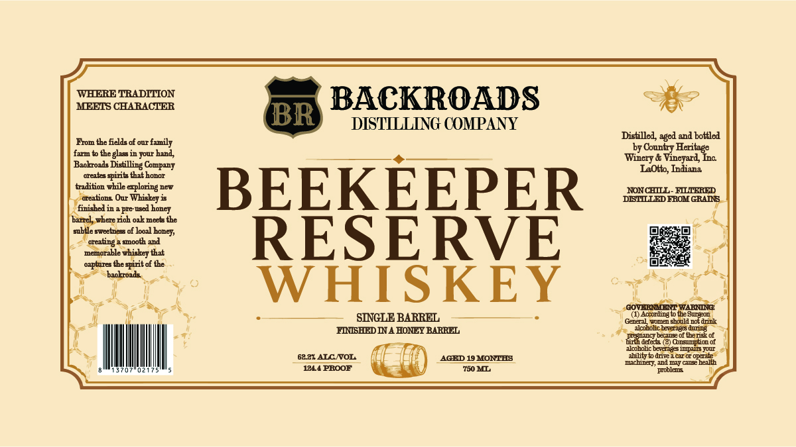

# TTB COLA Label Images - TTBID 26203001000525

**Brand Name:** BACKROADS DISTILLING COMPANY

**Fanciful Name:** BEEKEEPER RESERVE WHISKEY

**Issue Date:** 08/04/2026

**Origin Code:** 19

**Product Class/Type:** 140

**Source:** [TTB Public COLA Registry](https://ttbonline.gov/colasonline/viewColaDetails.do?action=publicFormDisplay&ttbid=26203001000525)

## Label Images

### Label 1

## Extracted Label Text

*Text extracted via OCR - may contain errors*

### Label 1

WHERE TRADITION
BACKROADS
MEETS CHARACTER
BR
DISTILLING COMPANY
Distilled
and bottled
From the ficlde of our family
by County
farm to thegls in jour hand
Winery & Vineyard
Bakoads Distilling =
LaOlto, Indiana
oreates girib thitE
tadition while
eploring
BEEKEEPER
NONCHLL
EILIERED
oreationa Our
DELLLLED FROM GRADS
finished in
pre
honey
barrel where rioh ozk meets the
subtle mweetnees of Jooil
oreating
mooth and
RESERVE
memorakle whiskey that
ozptures the spiit of the
baokroads
WHISKEY
GOVEELEMT WARU
SINGLE BARREL
(1) According
beSureeon
Cenera
wmen ghould not drink
FISHEDIA HONE BARREL
uollohc Luaants dmna
namc part ?
bberis of
btdfet
Oonsuntion 0f
alcoholic beveragsipu JuuT
62.87 ALC WOL
AGED 19 MONTHB
Wleacar 0 ODEle
machinery, admcushealth
1214 PROOF
750 ML
poblene
agcd _
Heritage
Inc
Compin]
bonor
Whiskcy -
mad
bongj
Ehile
