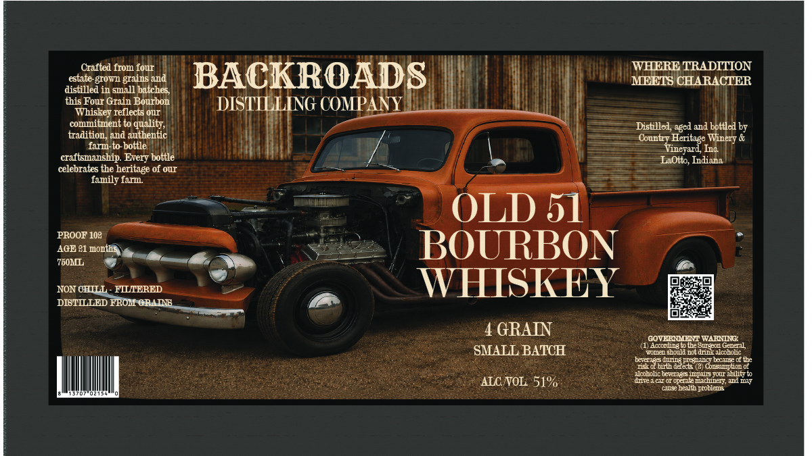

# TTB COLA Label Images - TTBID 26203001000533

**Brand Name:** BACKROADS DISTILLING COMPANY

**Fanciful Name:** OLD 51 BOURBON WHISKEY

**Issue Date:** 08/05/2026

**Origin Code:** 19

**Product Class/Type:** 141

**Source:** [TTB Public COLA Registry](https://ttbonline.gov/colasonline/viewColaDetails.do?action=publicFormDisplay&ttbid=26203001000533)

## Label Images

### Label 1

## Extracted Label Text

*Text extracted via OCR - may contain errors*

**Detected Proof:** 102

### Label 1

Crafted from four
WHERE TRADITION
estate-grown
and
BACKROADS
MEETS CHARACTER
distilled in small batches
this Four Grain Bourbon
DISTILLING COMPANY
Whiskey reflects Ou
commitment to
quality,
Dislillel
and bottled by
tradition; and authentic
Cbuntiy Heritage Winery &
farm-to-bottle
Vineyard Inc
craftsmanship Every bottle
LaOtto; Indiana
celebrates the heritage of ouI
family far
OLD 51
PROOF 108
AGE 81 months
BOURBON
760ML
NON OHILL
HILTERED
WHISKEY
DIBTILLED FROH GRAINB
GRAIN
GOVERILENT WARNDNG
(1) Accodingt the Sutei Gereal
SMALL BATCH
Fomed ;houl1 uot dinz alcoholic
bever383 during peguincy leuse of the
iskobirth deet: (8
Lonstmtaenon
alokolic teverages inpl8 YOur abilityto
ALCNOL 51%
Iidte1 Ctotoertaturanumdeit
al Ilt
cause health pobleu
Brains _
aged _
