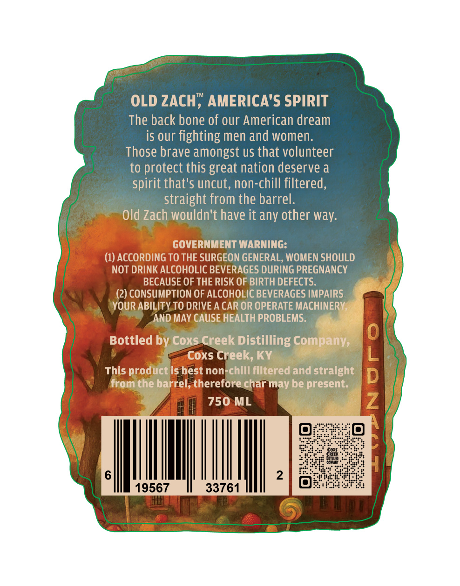
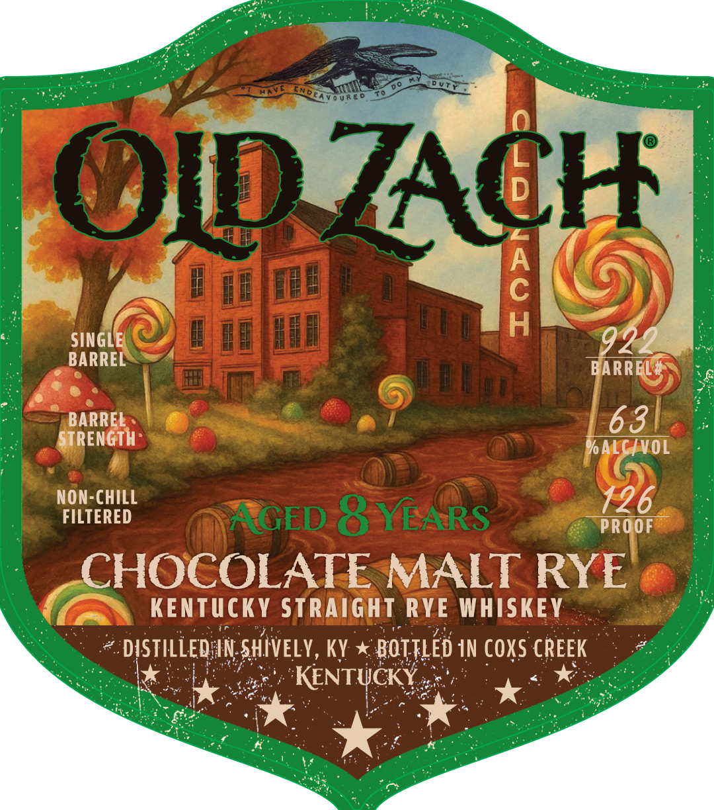

# TTB COLA Label Images - TTBID 26203001000542

**Brand Name:** OLD ZACH

**Fanciful Name:** CHOCOLATE MALT RYE

**Issue Date:** 07/28/2026

**Origin Code:** 22

**Product Class/Type:** 102

**Source:** [TTB Public COLA Registry](https://ttbonline.gov/colasonline/viewColaDetails.do?action=publicFormDisplay&ttbid=26203001000542)

## Label Images

### Back Label

### Front Label

## Extracted Label Text

*Text extracted via OCR - may contain errors*

**Detected Age:** 8 Years

### Back Label

OLD ZACH, AMERICA'S SPIRIT
The back bone of our American dream
is our fighting men and women:
Those brave amongst us that volunteer
to protect this great nation deserve a
spirit that's uncut, non-chill filtered,
straight from the barrel:
Old Zach wouldn't have it any other way:
GOVERNMENT WARNING:
(1) ACCORDING TO THE SURGEON GENERAL, WOMEN SHOULD
NOT DRINK ALCOHOLIC BEVERAGES DURING PREGNANCY
BECAUSE OF THE RISK OF BIRTH DEFECTS.
(2) CONSUMPTION OF ALCOHOLIC BEVERAGES IMPAIRS
YOUR ABILITY TO DRIVE A CAR OR OPERATE MACHINERV
AND MAY CAUSE HEALTH PROBLEMS:
Bottled by Coxs Creek Distilling Company;
Coxs Creek, KY
This product is best non-chill filtered and straight
1
from the barrel; therefore char may be present:
750 ML
2
19567
33761

### Front Label

0 U Re
OID ZACH
4
SINGLE
922
BARREL
BARREL ,
BARREL
63
STRENGTH
%ALCIVOL
NON-CHILL
126
FILTERED
AGED 8 YEARS
PROOF
CHOCOLATE MALT RYE
KENTUCKY Straight RYE WHISKEY
DISTILLEDAIN SHIVELY , KY
BOTTLED IN COXS CREEK
KENTUCKY
0o
