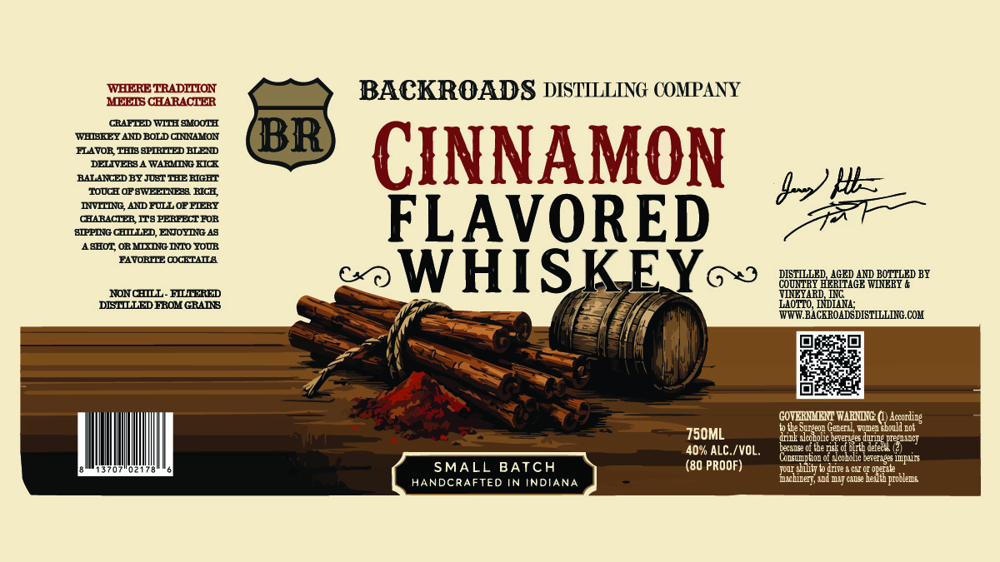

# TTB COLA Label Images - TTBID 26203001000545

**Brand Name:** BACKROADS DISTILLING COMPANY

**Issue Date:** 08/14/2026

**Origin Code:** 19

**Product Class/Type:** 149

**Source:** [TTB Public COLA Registry](https://ttbonline.gov/colasonline/viewColaDetails.do?action=publicFormDisplay&ttbid=26203001000545)

## Label Images

### Front Label

## Extracted Label Text

*Text extracted via OCR - may contain errors*

**Detected Proof:** 80

### Front Label

WHERE TRADILION
BACKROADS DISTILLING COMPANY
MEES CHARACTER
CRAFTED WITH MMOOTH
WHBBEEY AND BOLD CZUAMON
BR
FLAVOR THB BPIRTTED BLEI
CINNAMON
DELIVERS _
WARMDG HIC
BALANED BY JOST THERIGHT
TOUCH OFSWEETNES RICE
IITIG ANDFULL OFFTERY
CHARACTIER ITS PEREECTFOR
FLAVORED
HTPPING CHLLLED, EIQOYING 48
48HO2 OBMLXING INTO YOUR
EAVORITE OCKTAILA
WHISKEY
DISTILLED
AGED AII BOTTLED BY
COUTRY HERITAGE WINEBY &
NONTLLL _
FLLIERED
DBSTLLLEDEROH GRADB
LOTTO,
WWW BACEROADSDISTILLING. COH
GOVERMLT WARNLNG () According
the Supeo_ Gecera_
Fomen shoullco}
750ML
dnil alccholic
Awme NIeel JCT
40% ALC /VOL.
Lacanse 0itde N6E
7aE"eE icedunieg prer)
Consunptoz o1 9 coholic berecag : ImFaID
SMALL BATCH
(80 PROOF)
diity
Write & CNI CI Operate
HANDCRAFTED IN INDIANA
and m:T
hedmh
'problens
Itwi4
Ovbicen;
