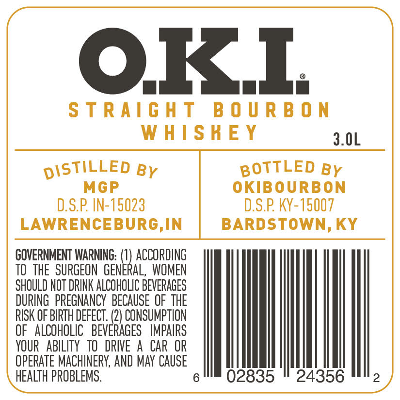
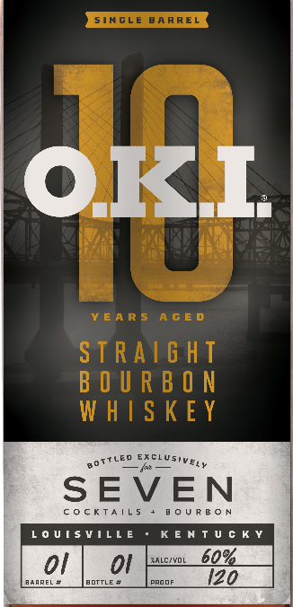

# TTB COLA Label Images - TTBID 26203001000588

**Brand Name:** O.K.I

**Issue Date:** 07/28/2026

**Origin Code:** 22

**Product Class/Type:** 101

**Source:** [TTB Public COLA Registry](https://ttbonline.gov/colasonline/viewColaDetails.do?action=publicFormDisplay&ttbid=26203001000588)

## Label Images

### Back Label

### Front Label

## Extracted Label Text

*Text extracted via OCR - may contain errors*

*1 image(s) excluded: text did not meet readability threshold*

### Back Label

OKL

STRAIGHT BOURB

WHISHEY $01

MGP

D.S.P. IN-15023
LAWRENCEBURG,IN

GOVERNMENT WARNING: Mu ACCORDING

TO THE SURGEON GENERAL, WOMEN
SHOULD NOT DRINK ALCOHOLIC BEVERAGES
DURING PREGNANCY BECAUSE OF THE
RISK OF BIRTH DEFECT. ) CONSUMPTION
OF ALCOHOLIC BEVERAGES IMPAIRS
YOUR ABILITY TO DRIVE A CAR OR
OPERATE MACHINERY, AND MAY CAUSE
HEALTH PROBLEMS.

BOTTLED By
OKIBOURBON
D.S.P. KY-15007
BARDSTOWN, KY

02835 " 24356

2
