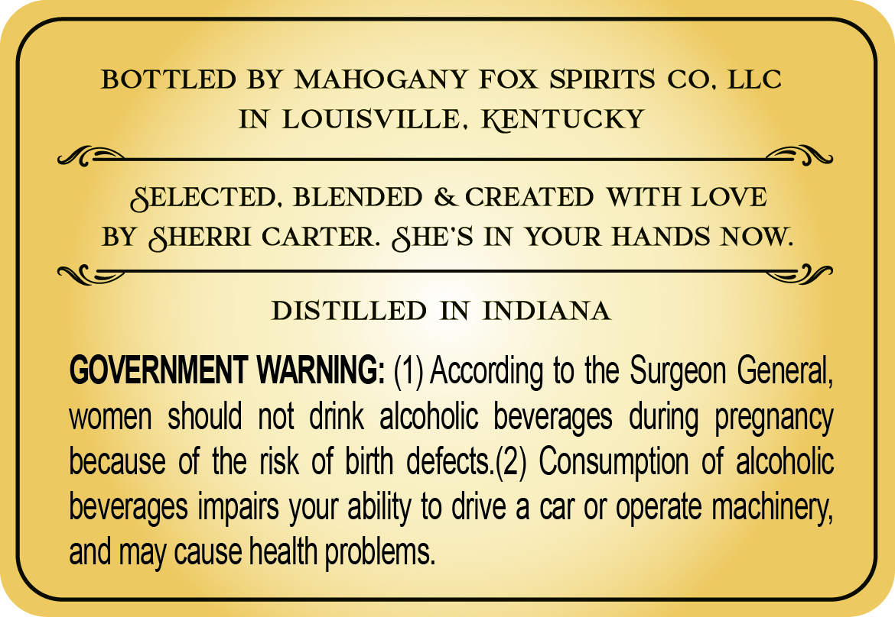
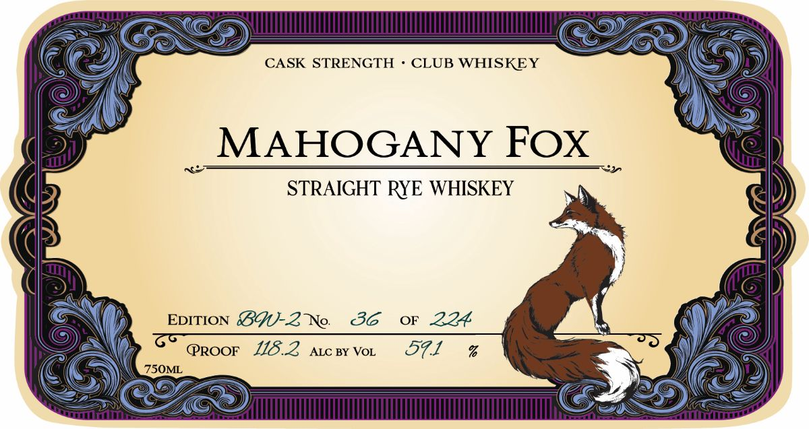

# TTB COLA Label Images - TTBID 26203001000639

**Brand Name:** MAHOGANY FOX

**Issue Date:** 07/28/2026

**Origin Code:** 22

**Product Class/Type:** 102

**Source:** [TTB Public COLA Registry](https://ttbonline.gov/colasonline/viewColaDetails.do?action=publicFormDisplay&ttbid=26203001000639)

## Label Images

### Back Label

### Label 1

### Label 3

### Label 4

## Extracted Label Text

*Text extracted via OCR - may contain errors*

*2 image(s) excluded: text did not meet readability threshold*

### Back Label

BOTTLED BY
MAHOGANY FOX SPRRITS CO, LLC
IN
LOUISVILLE,
KENTUCKY
SELECTED,
BLENDED
& CREATED
WITH LOVE
BY SHERRI CARTER  SHE'S IN
YOUR HANDS NOW:
DISTILLED
IN
INDIANA
GOVERNMENT WARNING: (1) According to the Surgeon General,
women should not drink alcoholic beverages during pregnancy
because of the risk of birth defects (2) Consumption of alcoholic
beverages impairs your ability to drive a car or operate machinery;
and may cause health problems

### Label 1

CASK STRENGTH
CLUB WHISKEY
MAHOGANY FOX
STRAIGHT RYE WHISKEY
EDITION
BC-2No
86
OF
224
PROOF
118.2
ALC BY VoL
571
%
7S0ML
