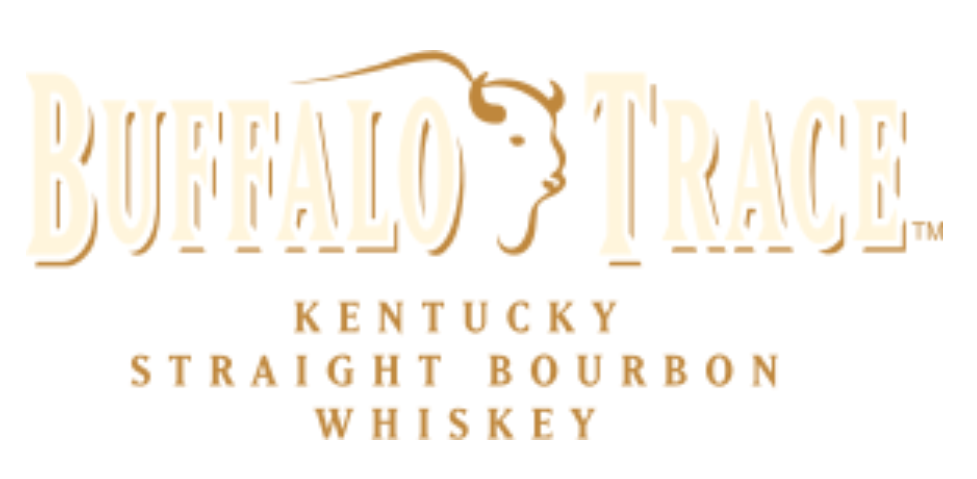
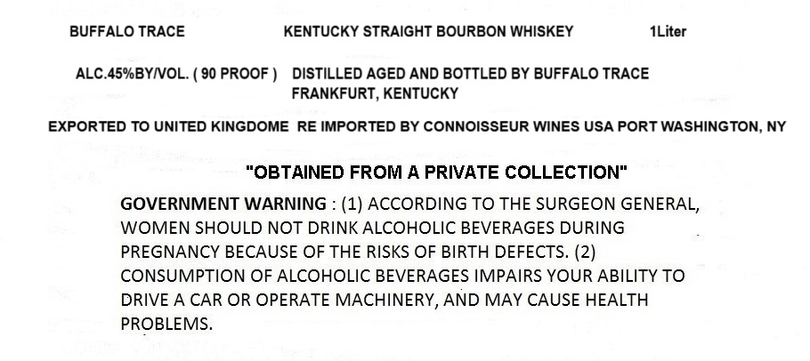

# TTB COLA Label Images - TTBID 26203001000642

**Brand Name:** BUFFALO TRACE

**Issue Date:** 07/28/2026

**Origin Code:** 02

**Product Class/Type:** 101

**Source:** [TTB Public COLA Registry](https://ttbonline.gov/colasonline/viewColaDetails.do?action=publicFormDisplay&ttbid=26203001000642)

## Label Images

### Back Label

### Label 1

## Extracted Label Text

*Text extracted via OCR - may contain errors*

**Detected Proof:** 90

### Back Label

DURAN? TRACE

KENTUCKY
STRAIGHT BOURBON
WHISKEY

### Label 1

BUFFALO TRACE
KENTUCKY STRAIGHT BOURBON WHISKEY
ILiter
ALC 45%BYNOL.
90 PROOF
DISTILLED AGED AND BOTTLED BY BUFFALO TRACE
FRANKFURT, KENTUCKY
EXPORTED TO UNITED KINGDOME RE IMPORTED BY CONNOISSEUR WINES USA PORT WASHINGTON; NY
"OBTAINED FROM A PRIVATE COLLECTION"
GOVERNMENT WARNING
(1) ACCORDING TO THE SURGEON GENERAL,
WOMEN SHOULD NOT DRINK ALCOHOLIC BEVERAGES DURING
PREGNANCY BECAUSE OF THE RISKS OF BIRTH DEFECTS. (2)
CONSUMPTION OF ALCOHOLIC BEVERAGES IMPAIRS YOUR ABILITY TO
DRIVE A CAR OR OPERATE MACHINERY, AND MAY CAUSE HEALTH
PROBLEMS
