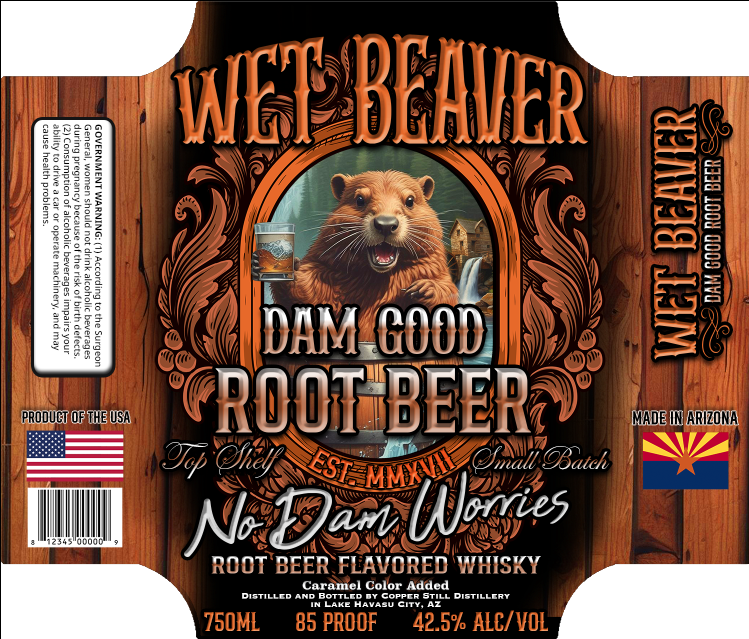

# TTB COLA Label Images - TTBID 26203001000826

**Brand Name:** WET BEAVER

**Issue Date:** 08/06/2026

**Origin Code:** 11

**Product Class/Type:** 149

**Source:** [TTB Public COLA Registry](https://ttbonline.gov/colasonline/viewColaDetails.do?action=publicFormDisplay&ttbid=26203001000826)

## Label Images

### Label 1

## Extracted Label Text

*Text extracted via OCR - may contain errors*

**Detected Proof:** 85

### Label 1

1
E
WNET EHER

H

9
M
8
HL
H
DAM_GOODI
Ql
product @F the u5A
ROOT BEER
Made HN ARIZONA
@op Ohelf
Onalt OBatch
N Dan
Jan Unbres
ROOT BEER FLAVORED WHISKY
Caramel Color Added
Disllcd ANc
BoTIL
Coppcf
Distillcry
LAKEZ
TaA
Cuty
5trl
750ML
85 PROOF
42.5% ALC/ VOL
J
