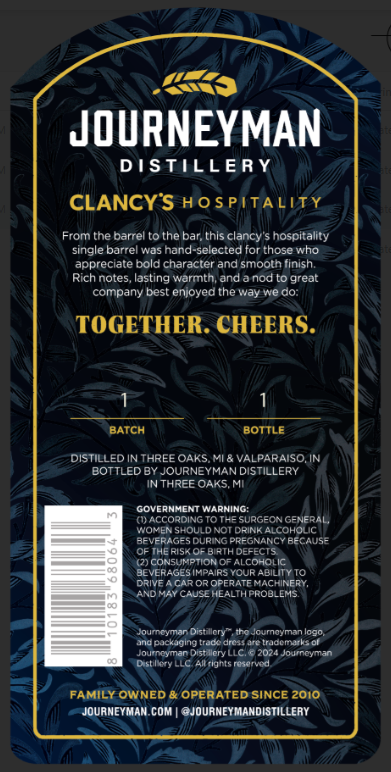
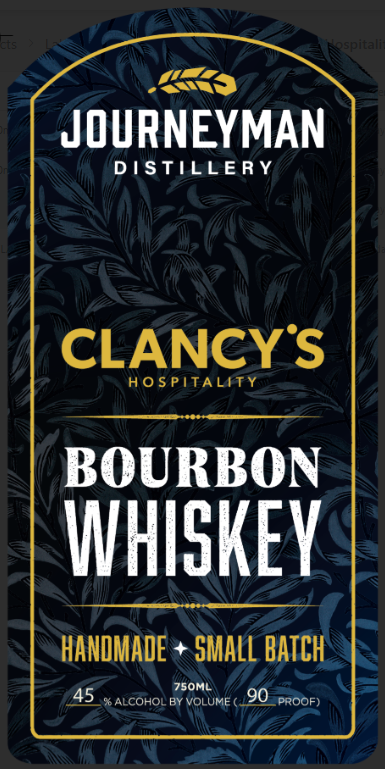

# TTB COLA Label Images - TTBID 26204001000061

**Brand Name:** JOURNEYMAN DISTILLERY

**Fanciful Name:** CLANCY'S HOSPITALITY BOURBON WHISKEY

**Issue Date:** 07/28/2026

**Origin Code:** 06

**Product Class/Type:** 141

**Source:** [TTB Public COLA Registry](https://ttbonline.gov/colasonline/viewColaDetails.do?action=publicFormDisplay&ttbid=26204001000061)

## Label Images

### Back Label

### Front Label

## Extracted Label Text

*Text extracted via OCR - may contain errors*

### Back Label

Lhenhn
MKS
DISTILLERY
CLANCY'S HOSPITALITY
From the barrel tothe bar this clancy’s hospitality
single barrel was hand-selected for those who
appreciate bold character and smooth finish
Rich notes, lasting warmth, and a nod to great
company best enjoyed the way we do:
1 1
Baten aorme
DISTILLED IN THREE OAKS. Ml & VALPARAISO. IN
BOTTLED BY JOURNEYMAN DISTILLERY
IN THREE OAKS, M
ESAECORDING To Tre SERGEON GENERAL
Wovgh snOu.D Not omne aiconpuc
Scvernets bums peecnaner secAIse
OF Me wear ath OEreeTS
Sconsurstonor n.conore
Sevemacesinnie vour aStiT¥ro
Dave Acar On OPERATE HAchINEny
BRO MAY CASREREALTI PROBLEMS
eine ter sme deumeyran ol
Si racadho uastshelae acest
Jouipeyman Stary LLeie 2084 oureeynad
Desiery Che atts eared
FAMILY OWNED & OPERATEDSINCE 2010
JOURNEYMAN.COM | QJOURNEYMANDISTILLERY

### Front Label

JOURNEYMAN

DISTILLERY

CLANCY S

HOSPITALITY

BOURBON

WHISKEY

HANDMADE + SMALL BATCH
