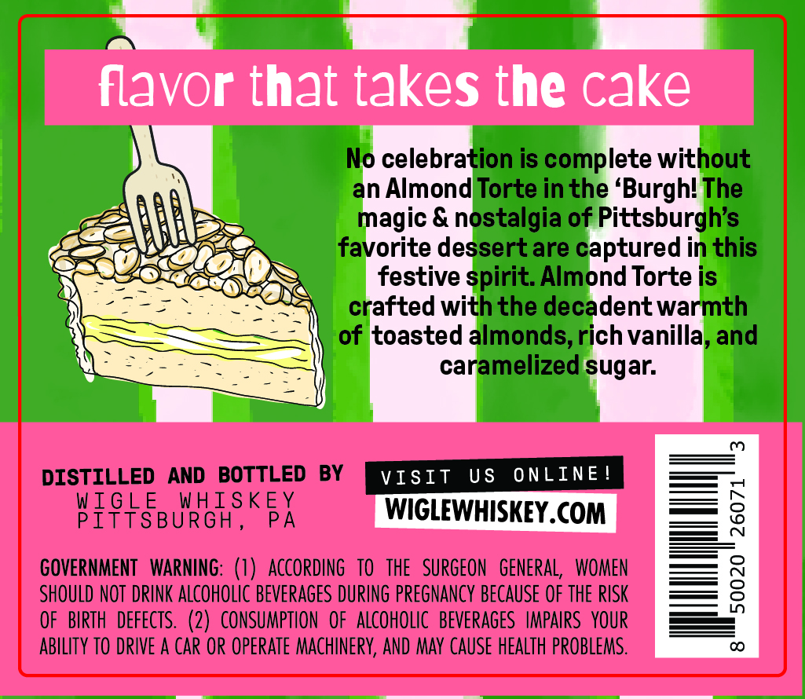
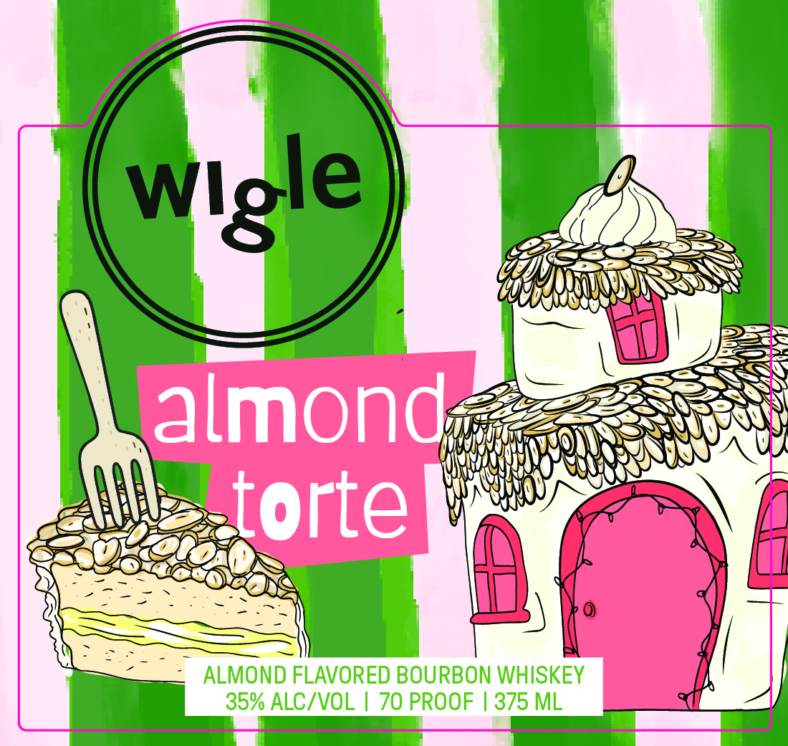

# TTB COLA Label Images - TTBID 26204001000069

**Brand Name:** WIGLE

**Fanciful Name:** ALMOND TORTE

**Issue Date:** 07/30/2026

**Origin Code:** 39

**Product Class/Type:** 149

**Source:** [TTB Public COLA Registry](https://ttbonline.gov/colasonline/viewColaDetails.do?action=publicFormDisplay&ttbid=26204001000069)

## Label Images

### Back Label

### Front Label

## Extracted Label Text

*Text extracted via OCR - may contain errors*

**Detected Proof:** 70

### Back Label

flavor that takes the cake
No celebration is complete without
Almond Torte in the 'Burghl The
magic &
ostalgia of Pittsburgh's
favorite dessertare c
ptured
this
festive spirit: Almond Torte is
crafted with the decadent warmth
of toasted almonds,
ich vanilla, and
caramelized sugar:
m
DISTILLED
AND   BOTTLED
BY
VISIt
US
ONLINE
PISHSBURGHS
HRGTSKFX
8
GOVERNMENT  WarninG: (7)   ACCORding   to  the   SURGEON   GenERAl;
WOMEN
SHOULD NOT DRINK ALCOhOlIc Beverages DuRING PRegnancy BECAUSE OF thE RISK
8
OF   BIRTH  defects.  (2)   CONSUMPTION  oF   ALCoHOLIc   BEVERAGES   HMPAIRS   YOUR
ABILITY TO DRIVE A Car OR operate MAChInERY, AND MAY CAUSE HEALTH PROBLEMS.
0

### Front Label

almond
torte
ALMOND FLAVORED BOURBON WHISKEY
35% ALC/VOL
70 PROOF
375 ML
Wlgle
