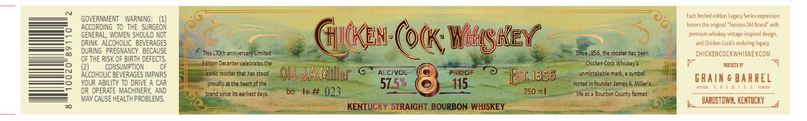

# TTB COLA Label Images - TTBID 26204001000111

**Brand Name:** CHICKEN COCK WHISKEY

**Issue Date:** 08/03/2026

**Origin Code:** 22

**Product Class/Type:** 101

**Source:** [TTB Public COLA Registry](https://ttbonline.gov/colasonline/viewColaDetails.do?action=publicFormDisplay&ttbid=26204001000111)

## Label Images

### Label 1

## Extracted Label Text

*Text extracted via OCR - may contain errors*

**Detected Proof:** 115

### Label 1

GOVERNMENT
WARNING:
(1)
Each limited edition Legacy Series expression
ACCORDING To THE   SURGEON
honors the original "Famous Old Brand"
~
GENERAL, WOMEN SHOULD NOT
GIcKen (o(k; Wobshey
premium whiskey; vintage-inspired design;
DRINK   ALCOHOLIC   BEVERAGES
and Chicken CocKs enduring legacy:
8
DURING   PREGNANCY   BECAUSE
This ! ZOth anniversary Limited
Since 1856,the rooster has been
chiCKENCOCKWHISKEYCOM
OF THE RISK OF BIRTH DEFECTS.
CONSUMPTION
OF
Edition Decanter celebrates the
Chicken Cock Whiskey' $
FEZOICED 8X
(2)
ALCOHOLIC BEVERAGES IMPAIRS
iconic rooster that has stood
Old &A Miller
ALCIVOL
PRoof
Est; 1856
unmistakable mark,  symbol
G RAIn & BARREL
YOUR ABILITY TO DRIVE A CAR
proudly at the heart of the
57.5%
115
rooted in founder James A. Miller $
p | R | T
OR OPERATE MACHINERY, AND
brand since its earliest
bo
le #
023
750 ml
life as a Bourbon County farmer
MAY CAUSE HEALTH PROBLEMS;
BaRDSTOWM, KENTUCKY
00
KENTUCKY STRAIGHT BOURBON WHISKEY
'with
days:
