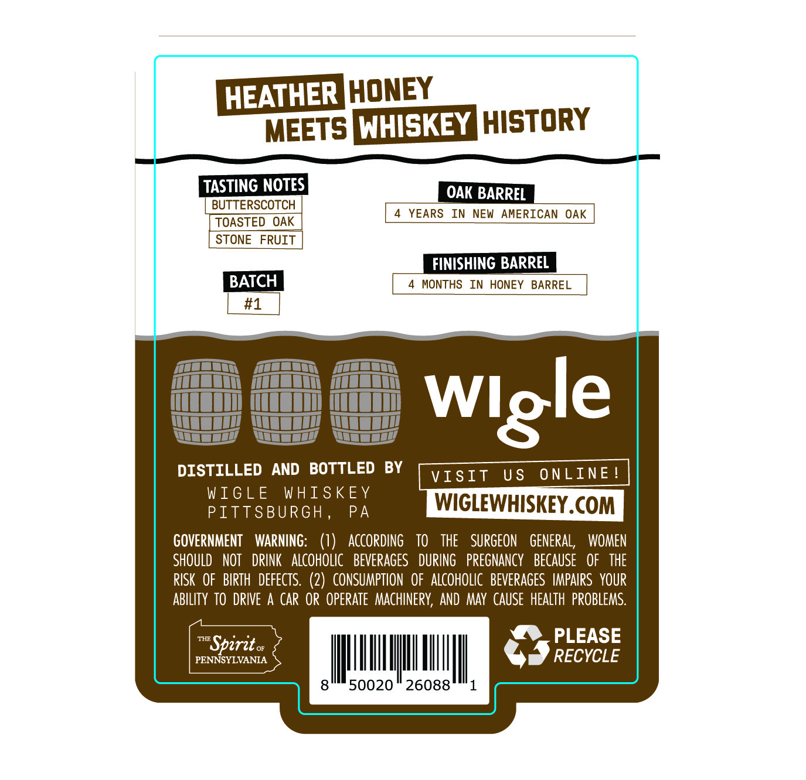
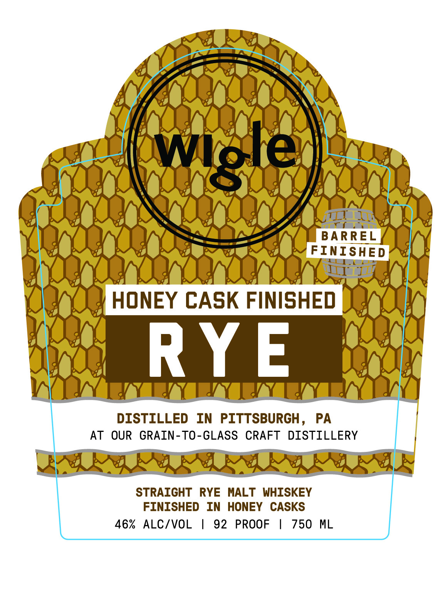

# TTB COLA Label Images - TTBID 26204001000130

**Brand Name:** WIGLE

**Issue Date:** 07/28/2026

**Origin Code:** 39

**Product Class/Type:** 102

**Source:** [TTB Public COLA Registry](https://ttbonline.gov/colasonline/viewColaDetails.do?action=publicFormDisplay&ttbid=26204001000130)

## Label Images

### Back Label

### Front Label

## Extracted Label Text

*Text extracted via OCR - may contain errors*

**Detected Proof:** 92

### Back Label

HEATHERIHoNEY
MEETs [hIsKEY history
TASTING NOTES]
OAK BARREL
BUTTERSCOTCH
YEARS
IN
NEW
AMERICAN OAK
TOASTED
OAK
STONE
FRUIT
FINISHING BARREL
BATCH
MONTHS
IN HONEY
BARREL
#1
DISTILLED
AND   BOTTLED
BY
VIsIt
U $
ONLINE
WIGLE
WHISKEY
PITTSBURGH
PA
WIGLEWHISKEY.COM
GOVERNMENT
WARNInG:
(1)
ACcORDIng
TO
THE
SURGEON   GeNERAL,
WOMEN
SHOULD   NOT   DRINK   aLcoholic   BeVERAGES
DURING   PREGNANCY
BECAUSE
OF   THE
RISK   OF   BIRTH   defects.  (2)  CONSUMPTION  OF   ALCOHOLIC   BEVERAGES  IMPAIRS  YOUR
ABILITY TO DRIVE A
CAR OR  Operate  MAchineRV, AND  May  CAUSE  HEALTh  PROBLEMS.
THE
PLEASE
Spirit
PENNSYLVANIA
RECYCLE
50020
26088
Wlgle

### Front Label

eee.
YONI
Owen.
COO ORE ONY
Tin Y1 1 Wee Va Al
JA HOW STO ve
CHa ee paeec- saege Gacgan
OO DOA
COUR DRE Oe tee
OOO VER
YORK OOOO AN
ONY HONEY CASK FINISHED [Quy
Koay CCaror
veyae| Dy
WV TAY YY TY TTY EY DY)
AT OUR GRAIN-TO-GLASS CRAFT DISTILLERY |
BRIE GR GRILL ARGS
FINISHED IN HONEY CASKS
46% ALC/VOL | 92 PROOF | 750 ML
