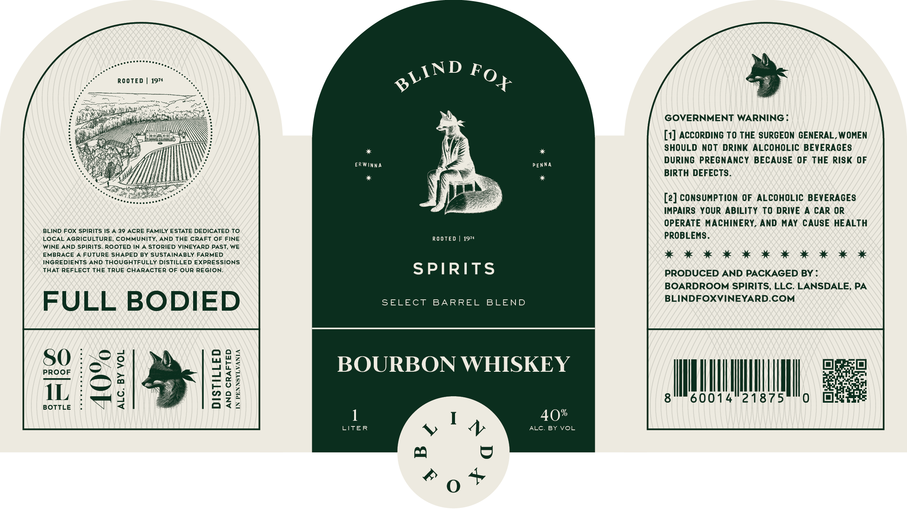

# TTB COLA Label Images - TTBID 26204001000163

**Brand Name:** BLIND FOX SPIRITS

**Issue Date:** 07/28/2026

**Origin Code:** 39

**Product Class/Type:** 141

**Source:** [TTB Public COLA Registry](https://ttbonline.gov/colasonline/viewColaDetails.do?action=publicFormDisplay&ttbid=26204001000163)

## Label Images

### Back Label

## Extracted Label Text

*Text extracted via OCR - may contain errors*

**Detected Proof:** 80

### Back Label

ROOTEd
1974
GOVERNMENT WARNING
[1] AccORDINC TO THE SURGEON CENERAL, WOMEN
SHOULD NOt Drink ALCOHOLIC BEVERAGES
ERWinnA
PENNA
DURING PREGNANCY BECAUSE OF THE RISK OF
BIRTH DEFECTS_
[2] CONSUMPTION OF ALCOHOLIC BEVERACES
IMPAIRS YOUR ABILITY TO DRIVE
CAR OR
OPERATE MAcHINERY, AND MAY CAUSE HEALTH
BLIND FOX SPIRITS IS
A 39 ACRE FAMILY ESTATE DEDICATED TO
LOCAL AGRICULTURE, COMMUNITY,
AND THE CRAFT OF FINE
Ro OTE D
1974
PROBLEMS .
WINE AND SPIRITS. ROOTED IN
STORIED VINEYARD PAST, WE
EMBRACE
FUTURE SHAPED BY SUSTAINABLY FARMED
INGREDIENTS AND THOUGHTFULLY DISTILLED EXPRESSIONS
THAT REFLECT THE TRUE CHARACTER OF OUR REGION:
SPIRITS
PRODUCED AND PACKAGED BY
BOARDROOM SPIRITS, LLC: LANSDALE, PA
FULL
BODIED
SELECT
BARREL
BLEND
BLINDFOXVINEYARD.COM
PROOF
80
1
IH
BOURBON WHISKEY
IL
9
8
60014
21875
0
BOTTLE
4
40%
LITER
ALC. BY VOL
6
A
+
BLIND
FOX
