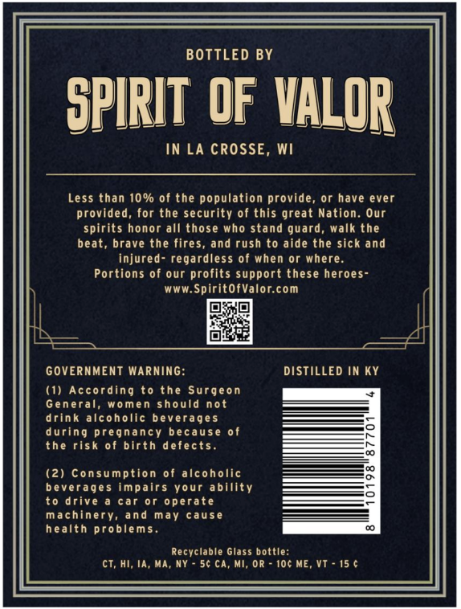
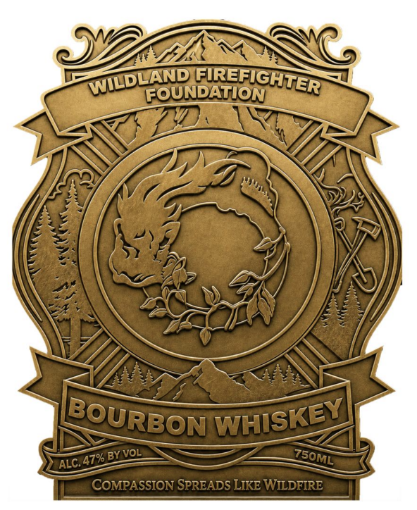

# TTB COLA Label Images - TTBID 26204001000181

**Brand Name:** WILDLAND FIREFIGHTER FOUNDATION

**Issue Date:** 07/28/2026

**Origin Code:** 48

**Product Class/Type:** 141

**Source:** [TTB Public COLA Registry](https://ttbonline.gov/colasonline/viewColaDetails.do?action=publicFormDisplay&ttbid=26204001000181)

## Label Images

### Back Label

### Front Label

## Extracted Label Text

*Text extracted via OCR - may contain errors*

### Back Label

BOTTLED BY
SPIRIT OF VALOR
In LA CROSSE, Wi
Less than 10% of the population provide
or have ever
provided;
for the security of this great Nation. Our
spirits honor all those who stand guard
walk the
beat,
brave the fires, and rush to aide the sick and
injured- regardless of when or where:
Portions of our profits support these heroes-
WWW.SpiritofValor.com
GOVERNMENT Warning:
DISTILLED IN KY
(1)
According
t0
Surgeon
General,
women should not
drink alcoholic beverages
during pregnancy because of
the risk of birth defects.
(2) Consumption of alcoholic
beverages impairs Your ability
to drive
car
or operate
machinery,
and may
cause
health problem s .
Recyclable Glass bottle:
cT, HI, Ia, Ma, NY
56 ca
MI; OR
10c ME_
the

### Front Label

FOUNDATION
47% BY VOL
COMPASSION SPREADS LIKE WILDFIRE
firefighter
WILDLAND
BOURBON
WHISKEY
ZboML
ALC:
