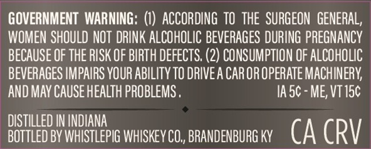
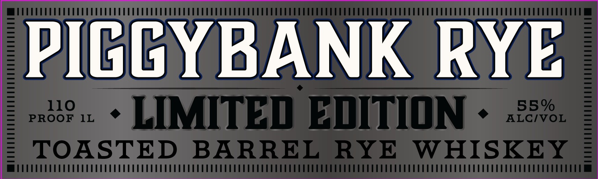

# TTB COLA Label Images - TTBID 26204001000322

**Brand Name:** WHISTLEPIG

**Issue Date:** 07/28/2026

**Origin Code:** 22

**Product Class/Type:** 142

**Source:** [TTB Public COLA Registry](https://ttbonline.gov/colasonline/viewColaDetails.do?action=publicFormDisplay&ttbid=26204001000322)

## Label Images

### Back Label

### Front Label

## Extracted Label Text

*Text extracted via OCR - may contain errors*

**Detected Proof:** 110

### Back Label

GOVERNMENT  WARNING: (I)  ACCORDING TOthe   SURGEON GENERAL,
WOMEN SHOULD NOT  DRINK ALCOHOLIC BEVERAGES DURING PREGNANCY
BECAUSE OF THE RISK OF BIRTH DEFECTS. (2) CONSUMPTION OF ALCOHOLIC
BEVERAGES IMPAIRS YOUR ABILITY TO DRIVEA CAR OR OpERATe MACHINERY
AND MAV CAUSE HEALTH PROBLEMS _
IA 5c - ME, VT15c
DISTILLED IN INDIANA
BOTTLED BV WHISTLEPIG WhISkeY CO,, BRANDENBURG KY
CA CRV

### Front Label

PICGYRANK RYE
110
55 %
PROOF
IL
LIMITED EITION
ALCIVOL
TOASTED
BARREL
RYE
WHISKEY
